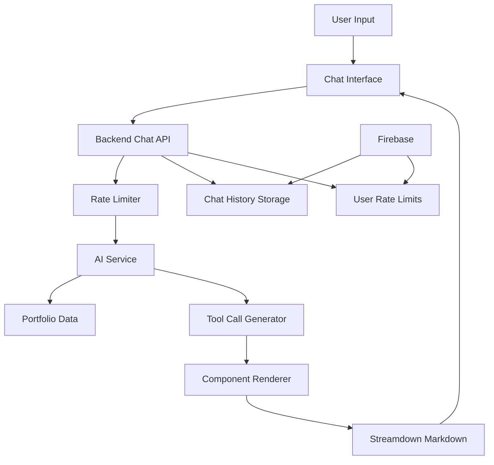

# Design Document

## Overview

The AI-powered portfolio chat system enhances the existing ChatPortfolio component with intelligent natural language understanding. Instead of keyword-based widget selection, the system uses an LLM (via Azure AI Inference) to analyze user queries and generate structured tool calls that dynamically render portfolio widgets. The system integrates with the existing FastAPI backend, Firebase infrastructure, and React-based chat interface, adding a new chat API endpoint with IP-based rate limiting, portfolio owner usage tracking, and conversation history management. Portfolio owners can control whether their chat is publicly accessible or requires authentication, with usage tracking for future pricing plans. The system is designed for small-scale deployment (10-15k users) with optimized but not over-engineered solutions.

## Architecture

### High-Level Architecture



### Component Architecture

The system is organized into several key components:

1. **Frontend Chat Interface** - React components for chat UI
2. **Backend Chat API** - FastAPI endpoint with rate limiting
3. **AI Processing Service** - LLM integration with tool calls
4. **Rate Limiting System** - Multi-tier rate limiting
5. **Chat Storage System** - Firebase-based chat history
6. **Component Rendering System** - Dynamic portfolio component rendering

## Components and Interfaces

### Frontend Components

#### Enhanced Chat Interface (`packages/template-components/src/components/`)

**ChatPortfolio.tsx (Enhanced)**

- Update existing component to call backend chat API instead of local keyword matching
- Replace `chooseWidget` function with API call to `/api/chat/{username}`
- Handle API responses containing text content and tool calls
- Maintain existing UI/UX with Thread, Composer, and widget rendering
- Add conversation_id tracking for context persistence

**chat/Thread.tsx (Enhanced)**

- Update Message type to support tool calls from backend
- Render widgets based on tool call responses
- Support indices-based filtering for showing specific items
- Handle markdown rendering for text responses
- Maintain existing animation and styling

#### Updated Chat Types (`packages/template-components/src/components/chat/types.ts`)

```typescript
// Extend existing Message type to support tool calls
export type Message = {
  id: string;
  role: "user" | "assistant";
  content: string;
  // Enhanced widget support with indices
  widget?: {
    name:
      | "about"
      | "projects"
      | "skills"
      | "contact"
      | "experience"
      | "education";
    props: Record<string, any>;
    indices?: number[]; // Optional: filter to specific items
  };
  // Optional: separate tool calls for multiple widgets
  toolCalls?: ToolCall[];
};

export type ToolCall = {
  type: "widget_render";
  widget:
    | "about"
    | "projects"
    | "skills"
    | "contact"
    | "experience"
    | "education";
  indices?: number[]; // Optional: specific items to show (zero-based)
  explanation?: string; // Optional: text to show alongside widget
};

// API request/response types
export type ChatRequest = {
  message: string;
  conversation_id?: string;
};

export type ChatResponse = {
  content: string; // Text response from LLM
  tool_calls?: ToolCall[];
  conversation_id: string;
};
```

### Backend Components

#### Portfolio Access Control Dependency (`backend/app/dependencies/portfolio_access.py`)

**check_portfolio_access(username: str, request: Request)**

- Reusable FastAPI dependency for checking portfolio access permissions
- Fetches user settings from Firebase to determine if portfolio is public or private
- If private: requires Bearer token authentication and verifies user matches portfolio owner
- If public: allows unauthenticated requests
- Returns portfolio owner's user_id for usage tracking
- Raises HTTP 403 if access denied
- Can be used by chat endpoint and other portfolio-related endpoints

#### Chat API Endpoint (`backend/app/routes/chat.py`)

**POST /api/chat/{username}**

- Uses `check_portfolio_access` dependency for access control
- Accepts ChatRequest with message and optional conversation_id
- Returns ChatResponse with content, tool_calls, and conversation_id
- IP-based rate limiting using in-memory/Redis (50 requests/hour per IP across all portfolios)
- Portfolio owner usage tracking in Firebase (monthly message count for pricing)
- Input validation: token counting, sanitization
- Fetches portfolio data for the specified username
- Stores chat history in Firebase Firestore (backend only, no UI)
- Handles errors gracefully with structured responses

#### AI Chat Service (`backend/app/services/ai_chat_service.py`)

**AIChatService Class**

- Extends or integrates with existing AIProcessor class
- Processes user queries with full portfolio data as context
- Uses Azure AI Inference (grok-3-mini model) for LLM calls
- Defines tool/function calling schema for widget rendering
- Implements carefully crafted system prompt (stored in backend code):
  - Focuses on portfolio owner's work, projects, and experience
  - Maintains warm, professional, and engaging tone
  - Handles general questions while relating back to portfolio
  - Politely redirects off-topic questions
- Generates structured tool calls based on LLM decisions
- Manages conversation context by including recent message history
- Handles token counting and limits using tiktoken
- Parses LLM responses to extract text content and tool calls
- Provides fallback responses when LLM fails

#### Enhanced Rate Limiting (`backend/app/dependencies/chat_rate_limiting.py`)

**Chat-Specific Rate Limiting Dependencies**

- Extends existing RateLimiter service from `backend/app/services/rate_limiter.py`
- **IP-based rate limiting**: Per-IP address across all portfolios using in-memory/Redis storage
  - Limit: 30-50 requests per hour per IP (configurable, can be generous since it's per-IP not per-portfolio)
  - Automatically discards expired records to prevent memory bloat
  - Fixed window implementation (simpler, less memory overhead)
  - Returns HTTP 429 with retry-after headers when exceeded
  - Note: Since viewers are unauthenticated, we can only rate limit by IP, not per-user
- **Portfolio owner usage tracking**: Tracks total monthly messages per portfolio in Firebase
  - Increments counter for each chat message received
  - Enforces monthly limit (100 messages default) for future pricing plans
  - Resets automatically at month boundaries
  - Stored in user_settings collection for efficient access
- Token count validation using tiktoken (max 60 tokens for user input)
- System prompt size validation (max 2000 tokens)

#### Chat Storage Service (`backend/app/services/chat_storage_service.py`)

**ChatStorageService Class**

- Stores chat history in Firebase Firestore (backend only, no UI for now)
- Associates chats with portfolio usernames
- Tracks IP addresses and timestamps for security monitoring
- Manages conversation threading with unique conversation IDs
- Supports conversation history retrieval for context
- Handles automatic cleanup of old conversations (30 days TTL)

### Configuration Constants (`backend/app/constants/chat_config.py`)

```python
class ChatConfig:
    """Configuration constants for AI-powered portfolio chat."""

    # Rate limiting
    IP_REQUESTS_PER_HOUR = 50  # Per-IP limit across all portfolios (can be generous)
    PORTFOLIO_MESSAGES_PER_MONTH = 100  # Per portfolio owner for pricing
    RATE_LIMIT_WINDOW_SECONDS = 3600  # 1 hour

    # Input validation
    MAX_USER_INPUT_TOKENS = 60
    MAX_SYSTEM_PROMPT_TOKENS = 2000

    # AI processing
    CHAT_MODEL_NAME = "grok-3-mini"  # Azure AI model
    MAX_CONVERSATION_HISTORY = 10  # Number of previous messages to include
    MAX_RESPONSE_TOKENS = 500  # Max tokens for LLM response

    # Storage
    CHAT_COLLECTION_NAME = "portfolio_chats"
    CONVERSATION_TTL_DAYS = 30

    # Access control
    DEFAULT_CHAT_ACCESS = "public"  # Default if not set in user settings

    # Tool calling
    SUPPORTED_WIDGETS = ["about", "projects", "skills", "contact", "experience", "education"]
```

## LLM Tool Calling Schema

The AI service will define a function/tool schema for the LLM to use when deciding to render widgets:

```python
WIDGET_RENDER_TOOL = {
    "type": "function",
    "function": {
        "name": "render_portfolio_widget",
        "description": "Render a specific portfolio widget to show relevant information to the user",
        "parameters": {
            "type": "object",
            "properties": {
                "widget": {
                    "type": "string",
                    "enum": ["about", "projects", "skills", "contact", "experience", "education"],
                    "description": "The type of portfolio widget to render"
                },
                "indices": {
                    "type": "array",
                    "items": {"type": "integer"},
                    "description": "Optional: Zero-based indices of specific items to show (e.g., [0, 2] for first and third items)"
                },
                "explanation": {
                    "type": "string",
                    "description": "Optional: Brief explanation of why these items are relevant to the user's query"
                }
            },
            "required": ["widget"]
        }
    }
}
```

The LLM will receive the full portfolio data in the system prompt and can make intelligent decisions about:

- Which widget(s) to show based on the user's query
- Whether to show all items or filter to specific indices
- What explanatory text to provide alongside the widget

### System Prompt Design

The system prompt will be stored in the backend code (not exposed to frontend) and will:

- Introduce the AI as representing the portfolio owner
- Provide the complete portfolio data as context
- Set guidelines for warm, professional, and engaging responses
- Focus on portfolio-related topics (work, projects, experience, interests)
- Handle general questions by relating them back to the portfolio
- Politely redirect off-topic questions
- Instruct the LLM on when and how to use the widget rendering tool

## Data Models

### Chat Data Models (`backend/app/schemas/chat.py`)

```python
from typing import Optional, List, Literal
from datetime import datetime
from pydantic import BaseModel, Field

class ToolCall(BaseModel):
    """Tool call for rendering portfolio widgets."""
    type: Literal["widget_render"] = "widget_render"
    widget: Literal["about", "projects", "skills", "contact", "experience", "education"]
    indices: Optional[List[int]] = Field(None, description="Zero-based indices of specific items to show")
    explanation: Optional[str] = Field(None, description="Optional explanation text")

class ChatMessage(BaseModel):
    """Individual chat message in a conversation."""
    id: str = Field(default_factory=lambda: str(uuid.uuid4()))
    role: Literal["user", "assistant"]
    content: str
    timestamp: datetime = Field(default_factory=datetime.utcnow)
    tool_calls: Optional[List[ToolCall]] = None

class ChatConversation(BaseModel):
    """Complete conversation thread."""
    id: str = Field(default_factory=lambda: str(uuid.uuid4()))
    username: str  # Portfolio username being viewed
    messages: List[ChatMessage]
    created_at: datetime = Field(default_factory=datetime.utcnow)
    updated_at: datetime = Field(default_factory=datetime.utcnow)
    ip_address: str
    user_id: Optional[str] = None  # Firebase UID if authenticated

class ChatRequest(BaseModel):
    """Request payload for chat endpoint."""
    message: str = Field(..., min_length=1, max_length=500)
    conversation_id: Optional[str] = None

class ChatResponse(BaseModel):
    """Response payload from chat endpoint."""
    content: str  # Text response from LLM
    tool_calls: Optional[List[ToolCall]] = None
    conversation_id: str
```

### Rate Limiting Models

```python
class ChatRateLimit(BaseModel):
    """Rate limit tracking for chat requests."""
    id: str  # Composite key: f"chat_{ip_address}" or f"chat_user_{user_id}"
    ip_address: Optional[str] = None
    user_id: Optional[str] = None
    requests_this_hour: int = 0
    requests_this_month: int = 0
    last_request: datetime
    hour_reset_time: datetime
    month_reset_date: datetime
    created_at: datetime = Field(default_factory=datetime.utcnow)
```

### User Settings Models (Extended)

```python
class PortfolioChatSettings(BaseModel):
    """Chat-specific settings for portfolio owners."""
    enabled: bool = True  # Whether chat is enabled at all
    access_mode: Literal["public", "private"] = "public"  # Public or private access
    monthly_message_count: int = 0  # Total messages received this month
    monthly_message_limit: int = 100  # Monthly limit for pricing
    month_reset_date: datetime
    last_message_at: Optional[datetime] = None

# This extends the existing UserSettings model in backend/app/schemas/user_settings.py
class UserSettings(BaseModel):
    user_id: str
    username: Optional[str] = None
    # ... existing fields ...
    chat_settings: Optional[PortfolioChatSettings] = Field(default_factory=lambda: PortfolioChatSettings())
```

## Error Handling

### Frontend Error Handling

**Error States**

- Network connectivity issues
- Rate limit exceeded
- Invalid portfolio username
- AI service unavailable

**Error Display**

- Graceful error messages in chat bubbles
- Retry mechanisms for transient failures
- Fallback to static suggestions when AI unavailable

### Backend Error Handling

**Rate Limiting Errors**

- HTTP 429 with detailed retry information
- Different error codes for IP vs user limits
- Clear messaging about limit types and reset times

**AI Processing Errors**

- Graceful fallback when AI service fails
- Logging of all AI processing errors
- Structured error responses for frontend handling

**Validation Errors**

- Input sanitization and validation
- Token count enforcement
- Portfolio data validation

## Testing Strategy

Testing will focus on integration tests for critical features that cannot be easily manually tested. The system is designed for small-scale deployment (10-15k users), so exhaustive testing is not required.

### Backend Integration Tests (Priority)

**Critical Path Testing**

- End-to-end chat flow with real portfolio data
- Public vs private access control enforcement
- IP-based rate limiting with memory cleanup
- Portfolio owner usage tracking and monthly limits
- Conversation threading and context retrieval
- Tool call generation and parsing
- Error handling and graceful degradation

**AI System Testing**

- Tool call accuracy with different query types
- System prompt effectiveness
- Conversation context handling
- Token limit enforcement

### Manual Testing (Sufficient for Most Cases)

- Frontend chat UI and widget rendering
- Different portfolio data structures
- Error states and user feedback
- Authentication flows for private portfolios

## Implementation Approach

The implementation will follow an incremental approach, building on existing infrastructure:

### Foundation (Existing)

- ChatPortfolio component with widget rendering
- AIProcessor service with Azure AI integration
- RateLimiter service with Firebase storage
- Portfolio data fetching and storage

### New Components

1. **Portfolio Access Control Dependency** (`backend/app/dependencies/portfolio_access.py`)

   - Reusable FastAPI dependency for checking portfolio access
   - Checks user settings for public/private mode
   - Handles authentication verification for private portfolios
   - Can be reused by other portfolio-related endpoints

2. **Backend Chat API** (`backend/app/routes/chat.py`)

   - New POST endpoint at `/api/chat/{username}`
   - Uses portfolio access control dependency
   - Integrates with existing portfolio service to fetch data
   - Uses new AIChatService for LLM processing
   - Applies chat-specific rate limiting

3. **AI Chat Service** (`backend/app/services/ai_chat_service.py`)

   - Extends AIProcessor patterns
   - Implements tool/function calling for widgets
   - Manages conversation context
   - Handles structured response parsing

4. **Chat Storage Service** (`backend/app/services/chat_storage_service.py`)

   - Manages conversation persistence in Firestore
   - Handles conversation threading
   - Supports conversation history retrieval

5. **Frontend Integration** (`packages/template-components/src/components/ChatPortfolio.tsx`)

   - Replace keyword matching with API calls
   - Handle API responses with tool calls
   - Maintain existing UI/UX patterns
   - Add conversation persistence

## Security Considerations

### Input Validation

- Strict token limits on user input
- Content sanitization to prevent injection
- Rate limiting to prevent abuse
- IP address tracking for security monitoring

### Data Privacy

- Chat history associated with portfolio usernames only
- Optional user authentication tracking
- IP address logging for security (not user identification)
- Configurable data retention policies

### AI Safety

- System prompt validation and limits
- Response content filtering
- Tool call validation to prevent unauthorized actions
- Monitoring for prompt injection attempts

## Performance Considerations

### Frontend Performance

- Lazy loading of chat components
- Efficient re-rendering with React optimization
- Streamdown performance for large markdown content
- Animation performance optimization

### Backend Performance

- Efficient rate limiting with minimal database queries
- AI service response caching where appropriate
- Optimized Firebase queries for chat history
- Connection pooling for external services

### Scalability

- Horizontal scaling of chat endpoints
- Rate limiting data partitioning
- AI service load balancing
- Firebase Firestore scaling considerations
