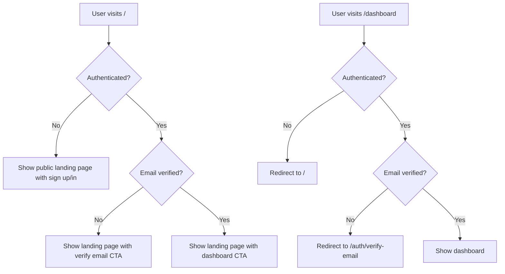

# Design Document

## Overview

This design document outlines the routing refactor for Portfolioly to establish a clear separation between public and authenticated experiences. The refactor will transform the current homepage at `/` into a public landing page and create a protected dashboard at `/dashboard` with a modern, card-based interface. The design leverages existing authentication infrastructure (Firebase, ProtectedRoute, withAuth HOC) and extends the user settings schema to support feature notification preferences.

## Architecture

### Routing Structure

```
/                           # Public landing page (unauthenticated + authenticated)
├── /auth/sign-in          # Sign in page
├── /auth/sign-up          # Sign up page
├── /auth/verify-email     # Email verification page
└── /dashboard             # Protected dashboard (authenticated + verified only)
    ├── Edit Portfolio     # Links to /edit
    ├── Create New         # Links to /upload
    ├── Analyze Chats      # Links to existing analysis route
    └── Resume Maker       # Coming soon with notification toggle
```

### Authentication Flow



### Component Architecture

```
HeaderBar (Global Navigation)
├── Logo/App Name → Dynamic routing based on auth status
├── Theme Toggle
└── Auth-dependent actions
    ├── Unauthenticated: Sign In, Sign Up
    └── Authenticated: Create, Edit, User Menu, Sign Out

Landing Page (/)
├── Hero Section
├── Feature Cards (Create, Manage, Showcase)
└── Auth-dependent CTA
    ├── Unauthenticated: Get Started, Sign In
    ├── Authenticated (unverified): Verify Email
    └── Authenticated (verified): Go to Dashboard

Dashboard (/dashboard)
├── Welcome Header (with user name/email)
├── Action Cards Grid
│   ├── Edit Portfolio Card → /edit
│   ├── Create New Card → /upload
│   ├── Analyze Chats Card → /analysis (or existing route)
│   └── Resume Maker Card (disabled)
│       └── Notify Me Toggle → Firestore update
└── Protected by withAuth HOC
```

## Components and Interfaces

### 1. Landing Page Component (`/`)

**Location**: `apps/main/src/app/(appShell)/page.tsx`

**Current State**: Already exists with basic structure
**Required Changes**:

- Keep existing public landing page structure
- Ensure authenticated users see dashboard CTA
- No automatic redirects (let users choose)

**Props**: None (uses AuthContext)

**State**:

- `user` - from AuthContext
- `loading` - from AuthContext

### 2. Dashboard Page Component (`/dashboard`)

**Location**: `apps/main/src/app/(appShell)/dashboard/page.tsx`

**Current State**: Basic dashboard exists with 3 cards
**Required Changes**:

- Update to 4 cards matching requirements
- Add Resume Maker card with notification toggle
- Integrate Firestore notification preference
- Update styling to match minimalistic design

**Props**: None (uses AuthContext, wrapped with withAuth)

**State**:

- `user` - from AuthContext
- `notifyForResume` - boolean from Firestore
- `isUpdatingNotification` - loading state for toggle

**Key Methods**:

- `fetchNotificationPreference()` - Load from Firestore on mount
- `toggleNotificationPreference()` - Update Firestore on toggle

### 3. HeaderBar Component

**Location**: `apps/main/src/components/HeaderBar.tsx`

**Current State**: Links to `/` for all users
**Required Changes**:

- Dynamic logo/app name routing based on auth status
- Unauthenticated: Navigate to `/`
- Authenticated + verified: Navigate to `/dashboard`
- Authenticated + unverified: Navigate to `/`

**Props**: None (uses AuthContext)

**Logic**:

```typescript
const homeRoute = user?.emailVerified ? "/dashboard" : "/";
```

### 4. Dashboard Action Cards

**Card Structure**:

```typescript
interface ActionCard {
  id: string;
  title: string;
  description: string;
  icon: LucideIcon;
  href?: string;
  disabled?: boolean;
  comingSoon?: boolean;
  hasNotificationToggle?: boolean;
}
```

**Cards Configuration**:

1. **Edit Portfolio**

   - Icon: Edit/Pencil
   - Description: "Edit and customize your existing portfolio"
   - Action: Navigate to `/edit`
   - Enabled: true

2. **Create New**

   - Icon: Plus/Upload
   - Description: "Create from LinkedIn/Resume/GitHub"
   - Action: Navigate to `/upload`
   - Enabled: true

3. **Analyze Chats**

   - Icon: MessageSquare/BarChart
   - Description: "View analytics and insights from portfolio chats"
   - Action: Navigate to existing analysis route
   - Enabled: true

4. **Resume Maker**
   - Icon: FileText
   - Description: "Create professional resumes (Coming Soon)"
   - Action: None (disabled)
   - Enabled: false
   - Has notification toggle: true

## Data Models

### User Settings Extension

**Firestore Collection**: `user_settings`
**Document ID**: `{user_id}`

**Extended Schema**:

```typescript
interface UserSettings {
  user_id: string;
  username?: string;
  access_mode: "public" | "private";
  public_token_enabled?: boolean;
  public_token_ver?: number;
  created_at?: string;
  updated_at?: string;
  chat_settings?: PortfolioChatSettings;

  // NEW FIELD
  notify_for_resume_feature?: boolean; // Default: false
}
```

### API Endpoints

**Existing**:

- `GET /api/user-settings` - Fetch user settings
- `PATCH /api/user-settings` - Update user settings

**Usage for Notification Toggle**:

```typescript
// Fetch current preference
const response = await fetch("/api/user-settings", {
  headers: { Authorization: `Bearer ${idToken}` },
});
const settings = await response.json();
const notifyForResume = settings.notify_for_resume_feature || false;

// Update preference
await fetch("/api/user-settings", {
  method: "PATCH",
  headers: {
    "Content-Type": "application/json",
    Authorization: `Bearer ${idToken}`,
  },
  body: JSON.stringify({
    notify_for_resume_feature: !notifyForResume,
  }),
});
```

## Correctness Properties

_A property is a characteristic or behavior that should hold true across all valid executions of a system-essentially, a formal statement about what the system should do. Properties serve as the bridge between human-readable specifications and machine-verifiable correctness guarantees._

### Property 1: Unauthenticated users always see public landing page at root

_For any_ unauthenticated user visiting `/`, the system should display the public landing page with sign-up and sign-in options, never redirecting automatically.

**Validates: Requirements 1.1, 1.3**

### Property 2: Dashboard requires authentication and verification

_For any_ user attempting to access `/dashboard`, if they are not authenticated OR not email-verified, the system should redirect them appropriately (to `/` for unauthenticated, to `/auth/verify-email` for unverified).

**Validates: Requirements 2.1, 2.2**

### Property 3: Authenticated verified users can access dashboard

_For any_ authenticated and email-verified user accessing `/dashboard`, the system should display the dashboard interface with their name/email in the welcome message.

**Validates: Requirements 2.3, 2.4**

### Property 4: Dashboard displays all required action cards

_For any_ dashboard render, the system should display exactly four action cards: Edit Portfolio, Create New, Analyze Chats, and Resume Maker, with Resume Maker being visually disabled.

**Validates: Requirements 3.1, 3.5**

### Property 5: Action card navigation is correct

_For any_ enabled action card click, the system should navigate to the correct route: Edit Portfolio → `/edit`, Create New → `/upload`, Analyze Chats → analysis route.

**Validates: Requirements 3.2, 3.3, 3.4**

### Property 6: Notification toggle persists to Firestore

_For any_ notification toggle action on the Resume Maker card, the system should immediately update the `notify_for_resume_feature` field in the user's Firestore document and reflect the new state in the UI.

**Validates: Requirements 4.2, 4.3**

### Property 7: Notification preference loads on dashboard mount

_For any_ dashboard load, the system should fetch the current `notify_for_resume_feature` value from Firestore and display the toggle in the correct state.

**Validates: Requirements 4.4**

### Property 8: Failed Firestore updates revert silently

_For any_ Firestore update failure when toggling notification preference, the system should revert the toggle to its previous state without displaying user-facing error messages.

**Validates: Requirements 4.5**

### Property 9: Header navigation is auth-aware

_For any_ user clicking the app name in the header, the system should navigate to `/` if unauthenticated or unverified, and to `/dashboard` if authenticated and verified.

**Validates: Requirements 5.1, 5.2**

### Property 10: Header displays auth-appropriate actions

_For any_ header render, the system should display sign-in/sign-up options for unauthenticated users, and navigation links (Create, Edit) plus user menu for authenticated verified users.

**Validates: Requirements 5.3, 5.4**

### Property 11: Dashboard UI is responsive

_For any_ viewport size, the dashboard should adapt its card layout responsively, maintaining usability on mobile, tablet, and desktop devices.

**Validates: Requirements 6.5**

### Property 12: Resume Maker card is visually distinct

_For any_ dashboard render, the Resume Maker card should be visually distinguishable from active cards through dimmed styling, disabled state, and "Coming Soon" label.

**Validates: Requirements 6.3**

## Error Handling

### Authentication Errors

**Scenario**: User session expires while on dashboard
**Handling**:

- ProtectedRoute detects no user
- Redirects to `/` with sign-in prompt
- No error toast (expected behavior)

**Scenario**: User loses email verification status
**Handling**:

- ProtectedRoute detects unverified user
- Redirects to `/auth/verify-email`
- No error toast (expected behavior)

### Firestore Errors

**Scenario**: Failed to fetch notification preference
**Handling**:

- Log error to console
- Default toggle to `false` (unchecked)
- No user-facing error message (silent failure)
- Allow user to still toggle (will attempt to save)

**Scenario**: Failed to update notification preference
**Handling**:

- Revert toggle to previous state
- Log error details to console
- No user-facing error message (silent failure)
- Toggle remains functional for retry

**Scenario**: Network timeout during Firestore operation
**Handling**:

- Same as failed update
- Log timeout to console
- No user-facing error message (silent failure)

### Navigation Errors

**Scenario**: Invalid route in action card
**Handling**:

- Catch navigation error silently
- Log error to console
- Keep user on dashboard
- No user-facing error message

## Testing Strategy

### Unit Testing

**Framework**: Jest + React Testing Library

**Test Files**:

1. `apps/main/src/app/(appShell)/page.test.tsx` - Landing page
2. `apps/main/src/app/(appShell)/dashboard/page.test.tsx` - Dashboard
3. `apps/main/src/components/HeaderBar.test.tsx` - Header navigation

**Key Test Cases**:

**Landing Page**:

- Renders public content for unauthenticated users
- Shows sign-up/sign-in buttons for unauthenticated users
- Shows dashboard CTA for authenticated verified users
- Shows verify email CTA for authenticated unverified users
- Displays feature cards correctly

**Dashboard**:

- Renders welcome message with user name/email
- Displays all four action cards
- Edit Portfolio card navigates to `/edit`
- Create New card navigates to `/upload`
- Analyze Chats card navigates to analysis route
- Resume Maker card is disabled
- Notification toggle updates Firestore
- Notification toggle reverts on error
- Loads notification preference on mount

**HeaderBar**:

- Logo links to `/` for unauthenticated users
- Logo links to `/dashboard` for authenticated verified users
- Logo links to `/` for authenticated unverified users
- Shows correct actions based on auth state

### Property-Based Testing

**Framework**: fast-check (JavaScript property-based testing library)

**Configuration**: Each property test should run a minimum of 100 iterations

**Test Tagging**: Each property-based test must include a comment with the format:

```typescript
// Feature: dashboard-routing-refactor, Property 1: Unauthenticated users always see public landing page at root
```

**Property Tests**:

1. **Property 1 Test**: Unauthenticated landing page

   - Generate: Various unauthenticated user states
   - Test: Landing page always renders public content
   - Verify: No automatic redirects occur

2. **Property 2 Test**: Dashboard protection

   - Generate: Various authentication states (no user, unverified user)
   - Test: Dashboard access attempts
   - Verify: Correct redirects occur

3. **Property 6 Test**: Notification persistence

   - Generate: Random toggle sequences
   - Test: Each toggle updates Firestore
   - Verify: Firestore document reflects final state

4. **Property 8 Test**: Error handling

   - Generate: Random Firestore failures
   - Test: Toggle behavior during failures
   - Verify: UI reverts and shows error

5. **Property 9 Test**: Header navigation
   - Generate: Various auth states
   - Test: Logo click behavior
   - Verify: Correct navigation target

### Integration Testing

**Scenarios**:

1. Complete user journey: Sign up → Verify → Dashboard → Navigate to features
2. Notification toggle: Load preference → Toggle → Verify Firestore → Reload page → Verify persistence
3. Auth state changes: Dashboard → Sign out → Redirect → Sign in → Return to dashboard
4. Error recovery: Toggle fails → Show error → Retry → Success

### Manual Testing Checklist

- [ ] Landing page displays correctly for all auth states
- [ ] Dashboard requires authentication and verification
- [ ] All action cards navigate correctly
- [ ] Resume Maker card is visually disabled
- [ ] Notification toggle works and persists
- [ ] Header navigation is auth-aware
- [ ] Mobile responsive layout works
- [ ] Error messages display correctly
- [ ] Loading states are smooth
- [ ] Theme toggle works on all pages

## Implementation Notes

### Existing Infrastructure to Leverage

1. **Authentication**:

   - `useAuth()` hook provides user state
   - `withAuth()` HOC for route protection
   - `ProtectedRoute` component handles redirects

2. **User Settings**:

   - Existing API endpoints for user settings
   - Firestore collection already established
   - Just need to extend schema with new field

3. **UI Components**:
   - Card, Button, and other UI components from shadcn/ui
   - Lucide icons for action cards
   - Existing theme system

### Component Reuse Strategy

**Maximize use of existing components** - no new custom components needed:

- Use existing `Card`, `CardHeader`, `CardTitle`, `CardDescription`, `CardContent` from shadcn/ui
- Use existing `Button` component for actions and navigation
- Use existing `Switch` or `Checkbox` component for notification toggle
- Use existing Lucide icons for card icons
- Use existing `Link` from Next.js for navigation
- Use existing `useAuth()` hook for user state
- Use existing API client patterns for Firestore updates
- Compose dashboard from existing UI primitives inline

### Styling Guidelines

**Dashboard Layout**:

- Max width: 7xl (1280px)
- Padding: px-4 py-8
- Card grid: 1 column mobile, 2 columns tablet, 4 columns desktop
- Gap: 6 (1.5rem)

**Action Cards**:

- Hover: Subtle shadow increase
- Disabled: Opacity 60%, cursor not-allowed
- Icon size: h-6 w-6
- Consistent padding: p-6

**Resume Maker Card (Disabled)**:

- Background: muted
- Text: muted-foreground
- Badge: "Coming Soon" in top-right
- Toggle: Below description

**Responsive Breakpoints**:

- Mobile: < 768px (1 column)
- Tablet: 768px - 1024px (2 columns)
- Desktop: > 1024px (4 columns)

### Performance Considerations

1. **Firestore Reads**:

   - Fetch notification preference once on dashboard mount
   - Cache in component state
   - Only refetch on page reload

2. **Firestore Writes**:

   - Debounce toggle if user clicks rapidly
   - Optimistic UI updates
   - Revert only on confirmed failure

3. **Route Protection**:
   - Leverage existing ProtectedRoute logic
   - No additional auth checks needed
   - Minimal performance impact

### Accessibility

1. **Keyboard Navigation**:

   - All cards focusable and clickable via keyboard
   - Toggle accessible via keyboard
   - Proper tab order

2. **Screen Readers**:

   - Proper ARIA labels on cards
   - Toggle state announced
   - Error messages announced

3. **Visual Indicators**:
   - Clear disabled state for Resume Maker
   - Loading states for async operations
   - Error states with color and text

### Future Enhancements

1. **Analytics Integration**:

   - Track dashboard visits
   - Track action card clicks
   - Track notification toggle usage

2. **Resume Maker Activation**:

   - When feature launches, remove disabled state
   - Add actual navigation
   - Notify users who opted in

3. **Additional Dashboard Widgets**:

   - Recent activity feed
   - Portfolio statistics
   - Quick actions menu

4. **Personalization**:
   - Customizable card order
   - Hide/show cards
   - Dashboard themes
