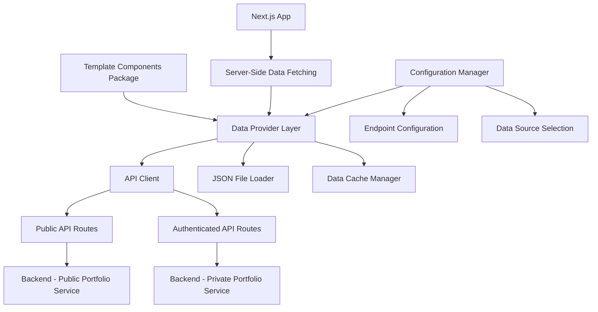

# Design Document

## Overview

This design transforms the template-components package from a static, hardcoded data system to a dynamic, API-driven architecture. The solution provides flexible data sourcing (API vs JSON), configurable endpoints, public portfolio publishing with usernames, and efficient data loading patterns optimized for Next.js applications.

## Architecture

### High-Level Architecture



### Data Flow

1. **Configuration Phase**: Consumer configures endpoints and data source preferences
2. **Data Loading Phase**: System fetches data based on configuration (server-side or client-side)
3. **Schema Mapping Phase**: Backend data is mapped to frontend schema format
4. **Component Rendering Phase**: Components receive processed data and render accordingly
5. **Caching Phase**: Data is cached for subsequent component usage

## Components and Interfaces

### 1. Configuration Interface

```typescript
interface TemplateConfig {
  // API Configuration
  apiEndpoints?: {
    publicPortfolio?: string; // GET /public/portfolio/{username}
    authenticatedPortfolio?: string; // GET /portfolio (with auth)
    usernameCheck?: string; // GET /public/username/{username}/available
  };

  // Data Source Configuration
  dataSource: "api" | "json" | "hybrid";

  // JSON File Configuration (when dataSource includes json)
  jsonFiles?: {
    portfolioData?: string; // Path to portfolio JSON file
  };

  // Authentication Configuration
  authToken?: string; // For authenticated routes

  // Performance Configuration
  enableCache?: boolean;
  cacheTimeout?: number; // Cache timeout in milliseconds
}
```

### 2. Data Provider Interface

```typescript
interface DataProvider {
  // Core data fetching
  getPortfolioData(username?: string): Promise<PortfolioData>;
  getAuthenticatedPortfolioData(): Promise<PortfolioData>;

  // Username management
  checkUsernameAvailability(username: string): Promise<boolean>;

  // Cache management
  clearCache(): void;
  refreshData(): Promise<void>;
}
```

### 3. Schema Mapping Interface

```typescript
interface SchemaMapper {
  // Map backend schema to frontend schema
  mapBackendToFrontend(backendData: BackendPortfolioData): PortfolioData;

  // Handle profile photo URL mapping
  mapProfilePhoto(backendProfile: BackendPersonalInfo): string | undefined;

  // Map social profiles
  mapProfiles(backendProfiles: BackendProfile[]): SocialLink[];
}
```

### 4. Public Portfolio API Routes (Backend)

New backend routes to be implemented:

```python
# Public portfolio routes (no authentication required)
@router.get("/public/portfolio/{username}")
def get_public_portfolio(username: str) -> PortfolioData:
    """Get public portfolio by username"""

@router.get("/public/username/{username}/available")
def check_username_availability(username: str) -> dict:
    """Check if username is available"""

# User settings routes (authentication required)
@router.put("/settings/username")
def set_username(username: str, user: UserToken) -> dict:
    """Set user's public username"""

@router.put("/settings/visibility")
def set_portfolio_visibility(is_public: bool, user: UserToken) -> dict:
    """Set portfolio public/private visibility"""
```

### 5. Username Management UI Components

```typescript
interface UsernameSelectionProps {
  currentUsername?: string;
  onUsernameChange: (username: string) => void;
  onVisibilityChange: (isPublic: boolean) => void;
}

interface UsernameAvailabilityProps {
  username: string;
  isChecking: boolean;
  isAvailable: boolean | null;
}
```

## Data Models

### Extended Backend Schema

```python
class UserSettings(BaseModel):
    """User settings for public portfolio"""
    username: Optional[str] = None
    is_public: Optional[bool] = False
    created_at: Optional[datetime] = None
    updated_at: Optional[datetime] = None

class Profile(BaseModel):
    """Extended profile with photo URL"""
    type: Optional[ProfileType] = None
    url: Optional[str] = None
    label: Optional[str] = None
    profile_photo_url: Optional[str] = None  # New field
    tags: Optional[List[str]] = Field(default_factory=list)
    more_context: Optional[str] = None
```

### Frontend Schema Updates

```typescript
export type PortfolioProfile = {
  name: string;
  headline: string;
  location?: string;
  avatarUrl?: string;
  profile_photo_url?: string; // New field from backend
  socials: SocialLink[];
};

export type PortfolioConfig = {
  username?: string;
  isPublic?: boolean;
  lastUpdated?: string;
};
```

## Error Handling

### Error Types and Responses

1. **Network Errors**: Connection failures, timeouts

   - Fallback to cached data or JSON files
   - Display offline indicators

2. **Authentication Errors**: Invalid tokens, expired sessions

   - Redirect to login for authenticated routes
   - Use public routes when possible

3. **Data Validation Errors**: Invalid schema, missing required fields

   - Log errors and use fallback data structures
   - Display error boundaries with helpful messages

4. **Username Conflicts**: Username already taken
   - Provide real-time availability checking
   - Suggest alternative usernames

### Error Boundary Implementation

```typescript
interface ErrorBoundaryState {
  hasError: boolean;
  errorType: "network" | "auth" | "validation" | "unknown";
  fallbackData?: PortfolioData;
}

class PortfolioErrorBoundary extends Component<Props, ErrorBoundaryState> {
  // Handle different error types with appropriate fallbacks
}
```

## Testing Strategy

### Backend API Testing

Focus on critical functionality that's difficult to test manually:

1. **Username Uniqueness**: Automated tests for concurrent username registration
2. **Access Control**: Tests ensuring private portfolios return 404 on public routes
3. **Schema Mapping**: Tests for backend-to-frontend data transformation
4. **Rate Limiting**: Tests for API rate limiting on public routes

### Integration Testing

1. **Data Provider Integration**: Test API client with mock backend responses
2. **Cache Behavior**: Test cache invalidation and refresh mechanisms
3. **Fallback Scenarios**: Test JSON file fallback when API is unavailable

### Manual Testing Areas

- UI components for username selection
- Visual rendering of portfolio components
- User experience flows for publishing portfolios
- Performance and loading states

## Performance Considerations

### Data Loading Optimization

1. **Server-Side Rendering**: Fetch data during Next.js SSR/SSG
2. **Incremental Static Regeneration**: Cache public portfolios with ISR
3. **Client-Side Caching**: Implement React Query or SWR for client-side cache
4. **Batch Loading**: Load all required data in single API call

### Caching Strategy

```typescript
interface CacheConfig {
  // Cache duration for different data types
  portfolioDataTTL: number; // 5 minutes for portfolio data
  usernameCheckTTL: number; // 30 seconds for username availability
  publicPortfolioTTL: number; // 1 hour for public portfolios

  // Cache invalidation triggers
  invalidateOnUserUpdate: boolean;
  invalidateOnVisibilityChange: boolean;
}
```

### Bundle Size Optimization

1. **Tree Shaking**: Ensure unused API clients are not bundled
2. **Code Splitting**: Lazy load username management components
3. **Conditional Loading**: Only load authentication logic when needed

## Security Considerations

### Access Control

1. **Public Route Security**: Ensure no sensitive data leaks in public responses
2. **Username Validation**: Prevent malicious usernames (profanity, reserved words)
3. **Rate Limiting**: Implement rate limiting on public portfolio routes
4. **Input Sanitization**: Sanitize all user inputs for username and portfolio data

### Data Privacy

1. **Opt-in Publishing**: Portfolios are private by default
2. **Data Minimization**: Public routes only return necessary data
3. **User Control**: Users can unpublish portfolios at any time
4. **Audit Logging**: Log public portfolio access for analytics (optional)

## Implementation Phases

### Phase 1: Core Infrastructure

- Implement configuration system
- Create data provider interfaces
- Add schema mapping utilities
- Set up error boundaries

### Phase 2: API Integration

- Implement API client
- Add authentication handling
- Create fallback mechanisms
- Implement caching layer

### Phase 3: Public Portfolio System

- Add backend routes for public portfolios
- Implement username management
- Create visibility controls
- Add username availability checking

### Phase 4: UI Components

- Build username selection components
- Add portfolio publishing controls
- Implement loading states
- Create error displays

### Phase 5: Optimization

- Add server-side data fetching
- Implement advanced caching
- Optimize bundle size
- Performance testing and tuning
