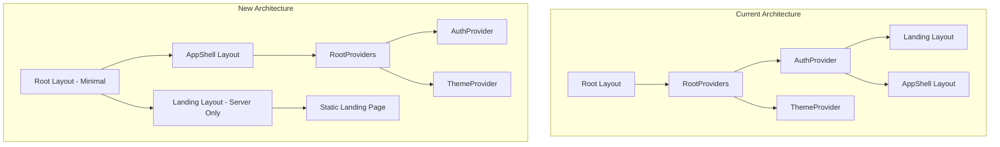

# Design Document: Landing Page SEO Optimization

## Overview

This design implements SEO best practices for the Portfolioly landing page by creating a "Firewall of Relevance" that isolates the marketing landing page from the heavy dashboard logic. The implementation restructures the layout hierarchy to prevent AuthProvider and other heavy client-side providers from polluting the landing page's JavaScript bundle.

**Target Audience**: Job seekers, developers, designers, and professionals looking to build free personal websites and portfolios.

Key changes:

1. Create a dedicated landing layout that bypasses RootProviders
2. Mark the landing page as statically generated
3. Add JSON-LD structured data for rich search results (WebApplication type per Google guidelines)
4. Implement robots.txt and sitemap.xml
5. Configure comprehensive metadata with Open Graph support
6. Target high-value SEO keywords for job seekers and portfolio builders

## Architecture



### Layout Hierarchy Changes

The key architectural change is moving `RootProviders` (containing `AuthProvider`) from the root layout to the appShell layout only. This ensures:

1. Landing page renders as a pure Server Component with minimal JS
2. Dashboard/authenticated pages retain full auth functionality
3. Theme script remains in root layout for FOUC prevention (it's inline, not a provider)

## Components and Interfaces

### 1. Root Layout (`app/layout.tsx`)

Simplified to only include:

- HTML structure with `lang` attribute
- Theme initialization script (inline, no hydration cost)
- Preconnect hints for CDN
- Basic body styling

```typescript
// No RootProviders wrapper - children rendered directly
export default function RootLayout({ children }) {
  return (
    <html lang="en" suppressHydrationWarning>
      <head>
        <script dangerouslySetInnerHTML={{ __html: getThemeScript() }} />
        <link rel="preconnect" href="https://media.portfolioly.app" />
      </head>
      <body>{children}</body>
    </html>
  );
}
```

### 2. Landing Layout (`app/(landing)/layout.tsx`)

Server Component with SEO metadata and JSON-LD:

```typescript
// Server Component - no "use client"
import type { Metadata } from "next";
import Script from "next/script";

export const metadata: Metadata = {
  metadataBase: new URL("https://portfolioly.app"),
  title: {
    default:
      "Portfolioly - Free AI Portfolio Builder | Create Your Portfolio in Seconds",
    template: "%s | Portfolioly",
  },
  description:
    "Build a stunning portfolio website for free. Import from LinkedIn or GitHub and let AI create your professional portfolio in seconds. No coding required.",
  alternates: { canonical: "/" },
  openGraph: {
    title: "Portfolioly - Free AI Portfolio Builder",
    description:
      "Turn your LinkedIn or GitHub into a beautiful portfolio website in seconds. 100% free, no coding required.",
    images: ["/og-image.png"],
    type: "website",
    siteName: "Portfolioly",
    locale: "en_US",
  },
  twitter: {
    card: "summary_large_image",
    title: "Portfolioly - Free AI Portfolio Builder",
    description:
      "Create your portfolio website in seconds. Import from LinkedIn or GitHub. 100% free.",
    creator: "@portfolioly",
  },
  robots: {
    index: true,
    follow: true,
    googleBot: {
      index: true,
      follow: true,
      "max-video-preview": -1,
      "max-image-preview": "large",
      "max-snippet": -1,
    },
  },
  keywords: [
    // Primary keywords (high search volume)
    "free portfolio website",
    "portfolio builder",
    "personal website builder",
    "free portfolio maker",
    "online portfolio",
    // Professional/Career focused
    "professional portfolio",
    "career portfolio",
    "work portfolio",
    // Developer/Designer focused
    "developer portfolio",
    "github portfolio",
    "programmer portfolio",
    "designer portfolio",
    "tech portfolio",
    // AI/Import focused
    "AI portfolio builder",
    "linkedin to portfolio",
    "resume to website",
    "github to portfolio",
    // Long-tail keywords
    "create portfolio website free",
    "build personal website free",
    "portfolio website generator",
    "online portfolio creator",
    "free personal website",
  ],
};

// Using WebApplication type as recommended by Google for web-based tools
const jsonLd = {
  "@context": "https://schema.org",
  "@type": "WebApplication",
  name: "Portfolioly",
  applicationCategory: "DesignApplication",
  operatingSystem: "Any",
  browserRequirements: "Requires JavaScript",
  url: "https://portfolioly.app",
  offers: {
    "@type": "Offer",
    price: "0",
    priceCurrency: "USD",
  },
  description:
    "Free AI-powered portfolio builder. Create a professional portfolio website from your LinkedIn profile or GitHub in seconds.",
  featureList: [
    "Import from LinkedIn PDF",
    "Import from GitHub",
    "AI-powered content generation",
    "Multiple portfolio layouts",
    "One-click deployment",
    "Custom themes",
  ],
  screenshot: "https://portfolioly.app/og-image.png",
  author: {
    "@type": "Organization",
    name: "Portfolioly",
    url: "https://portfolioly.app",
  },
  aggregateRating: {
    "@type": "AggregateRating",
    ratingValue: "4.8",
    ratingCount: "100",
    bestRating: "5",
    worstRating: "1",
  },
};

export default function LandingLayout({ children }) {
  return (
    <>
      <Script
        id="json-ld"
        type="application/ld+json"
        dangerouslySetInnerHTML={{ __html: JSON.stringify(jsonLd) }}
      />
      <div className="min-h-dvh flex flex-col">
        <main className="flex-1">{children}</main>
      </div>
    </>
  );
}
```

### 3. AppShell Layout (`app/(appShell)/layout.tsx`)

Now wraps children with RootProviders:

```typescript
import RootProviders from "@/components/RootProviders";

export default function AppShellLayout({ children }) {
  return (
    <RootProviders>
      <div className="min-h-dvh grid grid-rows-[auto_1fr_auto]">
        <HeaderBar />
        <main>{children}</main>
        <AppShellFooter />
      </div>
    </RootProviders>
  );
}
```

### 4. Robots Configuration (`app/robots.ts`)

```typescript
import { MetadataRoute } from "next";

export default function robots(): MetadataRoute.Robots {
  return {
    rules: {
      userAgent: "*",
      allow: "/",
      disallow: ["/dashboard/", "/api/", "/settings/", "/edit/", "/upload/"],
    },
    sitemap: "https://portfolioly.app/sitemap.xml",
  };
}
```

### 5. Sitemap Configuration (`app/sitemap.ts`)

```typescript
import { MetadataRoute } from "next";

export default function sitemap(): MetadataRoute.Sitemap {
  return [
    {
      url: "https://portfolioly.app",
      lastModified: new Date(),
      changeFrequency: "weekly",
      priority: 1,
    },
  ];
}
```

### 6. Landing Page (`app/(landing)/page.tsx`)

```typescript
// Force static generation
export const dynamic = "force-static";
export const revalidate = false;

export default function HomePage() {
  return (
    <>
      <Hero />
      {/* ... other components */}
    </>
  );
}
```

## Data Models

### JSON-LD Schema Structure

Using `WebApplication` type (subtype of SoftwareApplication) as recommended by Google for web-based tools:

```typescript
interface WebApplicationSchema {
  "@context": "https://schema.org";
  "@type": "WebApplication";
  name: string;
  applicationCategory: "DesignApplication";
  operatingSystem: "Any";
  browserRequirements: string;
  url: string;
  offers: {
    "@type": "Offer";
    price: string;
    priceCurrency: "USD";
  };
  description: string;
  featureList: string[];
  screenshot: string;
  author: {
    "@type": "Organization";
    name: string;
    url: string;
  };
  aggregateRating?: {
    "@type": "AggregateRating";
    ratingValue: string;
    ratingCount: string;
    bestRating: string;
    worstRating: string;
  };
}
```

### Metadata Configuration

```typescript
interface SEOMetadata {
  metadataBase: URL;
  title: { default: string; template: string };
  description: string;
  alternates: { canonical: string };
  openGraph: {
    title: string;
    description: string;
    images: string[];
    type: "website";
  };
  keywords: string[];
  icons: { icon: string };
}
```

## Correctness Properties

_A property is a characteristic or behavior that should hold true across all valid executions of a system-essentially, a formal statement about what the system should do. Properties serve as the bridge between human-readable specifications and machine-verifiable correctness guarantees._

Based on the prework analysis, the following properties can be verified:

### Property 1: JSON-LD Schema Validity

_For any_ rendered landing page, the JSON-LD script tag should contain valid JSON that parses to an object with "@type" equal to "WebApplication"
**Validates: Requirements 2.1**

### Property 2: JSON-LD Required Fields

_For any_ valid JSON-LD output from the landing page, parsing it should yield an object containing name, applicationCategory, offers.price, description, and author.name fields (per Google's required properties for SoftwareApplication rich results)
**Validates: Requirements 2.2, 2.3**

### Property 3: Robots Allow Root

_For any_ robots.txt output, the rules should include '/' in the allow list
**Validates: Requirements 4.2**

### Property 4: Robots Disallow Protected Paths

_For any_ robots.txt output, the rules.disallow array should contain '/dashboard/', '/api/', and '/settings/'
**Validates: Requirements 4.3**

### Property 5: Robots Sitemap Reference

_For any_ robots.txt output, the sitemap field should be a valid URL ending in 'sitemap.xml'
**Validates: Requirements 4.4**

### Property 6: Sitemap Landing Priority

_For any_ sitemap output, there should exist an entry with the root URL and priority equal to 1
**Validates: Requirements 5.2**

### Property 7: Sitemap LastModified

_For any_ entry in the sitemap output, the entry should have a lastModified field that is a valid Date
**Validates: Requirements 5.3**

## SEO Keyword Strategy

### Target Audience Segments

1. **Professionals**: Anyone needing to showcase their work and experience online
2. **Developers**: Software engineers wanting to display GitHub projects professionally
3. **Designers**: Creative professionals needing visual portfolios
4. **Students & Graduates**: New professionals building their online presence
5. **Career Changers**: Professionals transitioning careers who need to present transferable skills

### Keyword Categories

| Category     | Keywords                                                                  | Search Intent                |
| ------------ | ------------------------------------------------------------------------- | ---------------------------- |
| Primary      | "free portfolio website", "portfolio builder", "personal website builder" | High volume, competitive     |
| Professional | "professional portfolio", "career portfolio", "work portfolio"            | High intent, moderate volume |
| Developer    | "github portfolio", "developer portfolio", "tech portfolio"               | Technical audience           |
| AI/Import    | "linkedin to portfolio", "AI portfolio builder", "resume to website"      | Unique value prop            |
| Long-tail    | "create portfolio website free", "build personal website free"            | Lower competition            |

### Meta Description Best Practices

- Under 160 characters for full display
- Include primary keyword early
- Clear value proposition (free, AI-powered)
- Call to action implied ("in seconds")

### Open Graph Optimization

- Title: Concise, keyword-rich (under 60 chars)
- Description: Compelling, action-oriented
- Image: High-quality OG image at 1200x630px

## Error Handling

### Build-Time Validation

- If `metadataBase` URL is invalid, Next.js will throw a build error
- If JSON-LD contains invalid JSON, the build will fail
- TypeScript will catch missing required metadata fields

### Runtime Considerations

- Landing page is statically generated, so runtime errors are minimal
- Theme script uses try-catch for localStorage access (SSR safety)
- No auth-related errors possible on landing page (AuthProvider removed)

## Testing Strategy

### Dual Testing Approach

This feature uses both unit tests and property-based tests:

**Unit Tests**: Verify specific examples and edge cases

- Verify landing layout is a Server Component (no "use client")
- Verify metadata exports contain required fields
- Verify JSON-LD structure matches schema.org requirements

**Property-Based Tests**: Verify universal properties using `fast-check`

- Test that JSON-LD always contains required fields regardless of configuration
- Test that robots.txt always includes required allow/disallow rules
- Test that sitemap entries always have required fields

### Test Files

- `apps/main/src/app/__tests__/seo.test.ts` - Unit tests for SEO configuration
- `apps/main/src/app/__tests__/seo.property.test.ts` - Property-based tests

### Build Verification

After implementation, run `yarn build` in `apps/main` and verify:

1. Landing page (`/`) is marked with ○ (Static)
2. First Load JS for `/` is under 100KB
3. No build warnings about metadata
