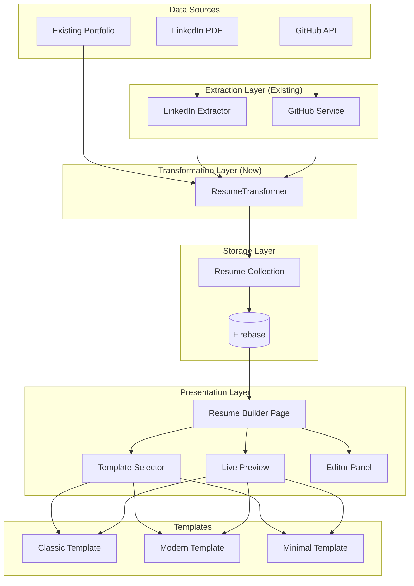

# Design Document

## Overview

The LinkedIn/GitHub Resume Builder transforms imported professional data into ATS-friendly, downloadable PDF resumes. The system uses a dedicated ResumeData schema stored in Firebase, with React-based HTML templates optimized for browser print/PDF export.

### Key Design Decisions

1. **Separate ResumeData Schema**: Optimized for resume formatting with array-based highlights, categorized skills, and section ordering
2. **Main App Implementation**: All resume components in `apps/main/src/components/resume/` for simplicity
3. **Browser Print for PDF**: Uses native `window.print()` with `@media print` CSS for reliable PDF generation
4. **Template Registry Pattern**: Templates self-register for automatic discovery in the selector

## Architecture



## Components and Interfaces

### ResumeTransformer

Transforms extracted data (from LinkedIn/GitHub/Portfolio) into ResumeData format.

```typescript
// apps/main/src/lib/resume/resumeTransformer.ts

interface ResumeTransformer {
  fromLinkedIn(linkedInData: LinkedInExtractedData): ResumeData;
  fromGitHub(repos: GitHubRepo[]): Partial<ResumeData>;
  fromPortfolio(portfolio: PortfolioData): ResumeData;
  mergeGitHubProjects(resume: ResumeData, repos: GitHubRepo[]): ResumeData;
}
```

### Template Registry

Central registry for resume templates with automatic discovery.

```typescript
// apps/main/src/components/resume/templates/registry.ts

interface TemplateDefinition {
  id: string;
  name: string;
  description: string;
  thumbnail: string;
  component: React.ComponentType<ResumeTemplateProps>;
}

interface TemplateRegistry {
  templates: TemplateDefinition[];
  getTemplate(id: string): TemplateDefinition | undefined;
  getDefaultTemplate(): TemplateDefinition;
}
```

### Resume Template Props

Standard interface for all resume templates.

```typescript
// apps/main/src/components/resume/templates/types.ts

interface ResumeTemplateProps {
  data: ResumeData;
  sectionOrder: string[];
  isPrintMode?: boolean;
}
```

### Resume Builder Page

Main page component orchestrating the resume building experience.

```typescript
// apps/main/src/app/(appShell)/resume-builder/page.tsx

// State management
interface ResumeBuilderState {
  resume: ResumeData | null;
  selectedTemplateId: string;
  isDirty: boolean;
  isLoading: boolean;
}
```

### Resume Service

Backend service for resume CRUD operations.

```python
# backend/app/services/resume_service.py

class ResumeService:
    async def create_resume(self, user_id: str, data: ResumeData) -> str
    async def get_resume(self, user_id: str, resume_id: str) -> ResumeData
    async def list_resumes(self, user_id: str) -> List[ResumeSummary]
    async def update_resume(self, user_id: str, resume_id: str, data: ResumeData) -> bool
    async def delete_resume(self, user_id: str, resume_id: str) -> bool
    async def duplicate_resume(self, user_id: str, resume_id: str) -> str
```

## Data Models

### ResumeData Schema

```typescript
// apps/main/src/types/resume.ts

interface ResumeData {
  id: string;
  name: string;
  template_id: string;
  section_order: SectionType[];

  personal_info: ResumePersonalInfo;
  summary: string | null;
  work_experiences: ResumeWorkExperience[];
  education: ResumeEducation[];
  projects: ResumeProject[];
  skills: ResumeSkills;
  certifications: ResumeCertification[];

  created_at: string;
  updated_at: string;
}

interface ResumePersonalInfo {
  full_name: string;
  email: string | null;
  phone: string | null;
  location: string | null;
  linkedin_url: string | null;
  github_url: string | null;
  website_url: string | null;
}

interface ResumeWorkExperience {
  id: string;
  company: string;
  title: string;
  location: string | null;
  start_date: DateInfo;
  end_date: DateInfo | null;
  is_current: boolean;
  highlights: string[]; // Array of bullet points
}

interface ResumeEducation {
  id: string;
  institution: string;
  degree: string;
  field: string | null;
  location: string | null;
  start_date: DateInfo;
  end_date: DateInfo | null;
  gpa: string | null;
  highlights: string[];
}

interface ResumeProject {
  id: string;
  name: string;
  description: string | null;
  technologies: string[];
  url: string | null;
  highlights: string[];
}

interface ResumeSkills {
  categories: SkillCategory[];
}

interface SkillCategory {
  name: string; // e.g., "Languages", "Frameworks", "Tools"
  items: string[];
}

interface ResumeCertification {
  id: string;
  name: string;
  issuer: string | null;
  date: string | null;
}

type SectionType =
  | "summary"
  | "experience"
  | "education"
  | "projects"
  | "skills"
  | "certifications";
```

### Firebase Collection Structure

```
users/
  {uid}/
    resumes/
      {resumeId}/
        - id: string
        - name: string
        - template_id: string
        - section_order: string[]
        - personal_info: {...}
        - summary: string
        - work_experiences: [...]
        - education: [...]
        - projects: [...]
        - skills: {...}
        - certifications: [...]
        - created_at: timestamp
        - updated_at: timestamp
```

## Correctness Properties

_A property is a characteristic or behavior that should hold true across all valid executions of a system-essentially, a formal statement about what the system should do. Properties serve as the bridge between human-readable specifications and machine-verifiable correctness guarantees._

### Property 1: LinkedIn to ResumeData Transformation Preserves Data

_For any_ valid LinkedIn extracted data, transforming it to ResumeData SHALL preserve all personal information fields, work experiences, education entries, and certifications without data loss.

**Validates: Requirements 1.1, 1.2**

### Property 2: GitHub Repositories Sorted by Stars

_For any_ list of GitHub repositories, the displayed list SHALL be sorted in descending order by star count.

**Validates: Requirements 2.2**

### Property 3: Selected Repos Appear in Projects

_For any_ set of selected GitHub repositories, all selected repos SHALL appear in the projects section of the resulting ResumeData with matching names and descriptions.

**Validates: Requirements 2.3**

### Property 4: Template Selection Persistence Round Trip

_For any_ ResumeData with a template_id, saving and then loading the resume SHALL return the same template_id.

**Validates: Requirements 4.4**

### Property 5: Resume Save/Load Round Trip

_For any_ valid ResumeData, saving to Firebase and loading back SHALL produce an equivalent ResumeData object.

**Validates: Requirements 6.3**

### Property 6: Section Order Determines Render Order

_For any_ ResumeData with a section_order array, the rendered HTML sections SHALL appear in the same order as specified in section_order.

**Validates: Requirements 8.2, 8.3**

### Property 7: ATS-Friendly HTML Structure

_For any_ rendered resume template, the HTML output SHALL contain proper heading hierarchy (h1 for name, h2 for sections) and SHALL NOT contain table elements used for layout.

**Validates: Requirements 7.1, 7.2**

### Property 8: All Template Content is Selectable Text

_For any_ rendered resume template, all content SHALL be in text nodes (not images), ensuring ATS systems can parse the content.

**Validates: Requirements 7.3**

### Property 9: Standard Section Headings

_For any_ rendered resume template, section headings SHALL match ATS-recognized names: "Experience" or "Work Experience", "Education", "Skills", "Projects", "Certifications".

**Validates: Requirements 7.4**

### Property 10: Resume Creation Generates Unique ID

_For any_ two resumes created by the same user, each SHALL have a unique ID.

**Validates: Requirements 10.1**

### Property 11: Resume Duplication Preserves Content

_For any_ duplicated resume, the copy SHALL have a different ID but identical content (personal_info, work_experiences, education, projects, skills, certifications).

**Validates: Requirements 10.3**

### Property 12: Resume Deletion Removes from Storage

_For any_ deleted resume, subsequent retrieval attempts SHALL return not found.

**Validates: Requirements 10.4**

### Property 13: Registered Templates Appear in Selector

_For any_ template registered in the TemplateRegistry, it SHALL appear in the Template_Selector options.

**Validates: Requirements 9.3**

## Error Handling

### Data Import Errors

| Error Type              | Cause                       | User Message                                                                                 | Recovery                |
| ----------------------- | --------------------------- | -------------------------------------------------------------------------------------------- | ----------------------- |
| `LINKEDIN_PARSE_ERROR`  | Invalid LinkedIn PDF format | "Unable to parse LinkedIn PDF. Please ensure you're uploading a valid LinkedIn profile PDF." | Retry upload            |
| `GITHUB_USER_NOT_FOUND` | Invalid GitHub username     | "GitHub user not found. Please check the username."                                          | Re-enter username       |
| `GITHUB_RATE_LIMIT`     | API rate limit exceeded     | "GitHub API limit reached. Please try again in a few minutes."                               | Auto-retry with backoff |
| `PORTFOLIO_NOT_FOUND`   | No existing portfolio data  | "No portfolio data found. Please import from LinkedIn or GitHub first."                      | Show import options     |

### Storage Errors

| Error Type         | Cause                   | User Message                                 | Recovery                |
| ------------------ | ----------------------- | -------------------------------------------- | ----------------------- |
| `RESUME_NOT_FOUND` | Resume ID doesn't exist | "Resume not found."                          | Redirect to resume list |
| `SAVE_FAILED`      | Firebase write error    | "Failed to save resume. Please try again."   | Retry save              |
| `DELETE_FAILED`    | Firebase delete error   | "Failed to delete resume. Please try again." | Retry delete            |

### Template Errors

| Error Type           | Cause                      | User Message                                               | Recovery             |
| -------------------- | -------------------------- | ---------------------------------------------------------- | -------------------- |
| `TEMPLATE_NOT_FOUND` | Invalid template ID        | "Template not found. Using default template."              | Fall back to default |
| `RENDER_ERROR`       | Template rendering failure | "Error rendering resume. Please try a different template." | Switch template      |

## Testing Strategy

### Unit Testing

Unit tests verify specific functionality:

1. **ResumeTransformer tests**: Verify transformation from LinkedIn/GitHub/Portfolio to ResumeData
2. **Template Registry tests**: Verify template registration and retrieval
3. **Date formatting tests**: Verify date display in resume format
4. **Section ordering tests**: Verify sections render in correct order

### Property-Based Testing

Property-based tests use **fast-check** library for TypeScript to verify universal properties:

1. **Transformation properties**: LinkedIn/GitHub data transforms correctly
2. **Round-trip properties**: Save/load preserves data
3. **Ordering properties**: Section order is respected
4. **ATS compliance properties**: HTML structure meets requirements

Each property test SHALL:

- Run a minimum of 100 iterations
- Use generators for ResumeData, LinkedIn data, and GitHub repos
- Be tagged with the property number from this design document

### Integration Testing

1. **Import flow**: End-to-end LinkedIn PDF upload → ResumeData creation
2. **CRUD operations**: Create, read, update, delete resumes
3. **Template switching**: Verify template changes apply correctly
4. **PDF export**: Verify print CSS produces correct output

### Test File Organization

```
apps/main/src/
  lib/resume/
    __tests__/
      resumeTransformer.test.ts
      resumeTransformer.property.test.ts
  components/resume/
    __tests__/
      templates.test.tsx
      templates.property.test.ts
backend/
  tests/
    test_resume_service.py
    test_resume_routes.py
```
