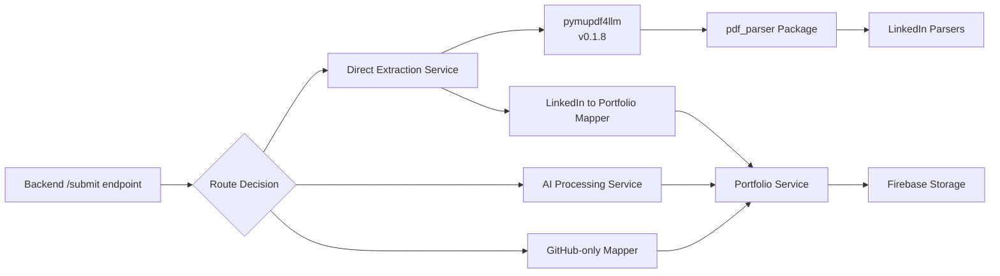

# Design Document

## Overview

This feature optimizes the portfolio upload workflow by implementing direct structured extraction for LinkedIn PDFs when combined with GitHub data. The system uses pymupdf4llm in the backend to convert PDFs to markdown, then leverages the existing pdf_parser package for structured parsing. This creates a fast, cost-effective path for LinkedIn + GitHub submissions while maintaining the AI processing path for resume PDFs.

## Architecture

### High-Level Processing Flow

```mermaid
graph TD
    A[/ingest/pdf endpoint] --> B{Check source type}
    B -->|LinkedIn PDF| C[Convert to markdown<br/>using pymupdf4llm]
    B -->|Resume PDF| D[Extract plain text<br/>using PyMuPDF]
    C --> E[Return markdown to frontend]
    D --> E[Return text to frontend]

    F[/submit endpoint receives data] --> G{Check data sources}
    G -->|Resume PDF present| H[AI Processing Path]
    G -->|Only GitHub| I[GitHub-only mapping]
    G -->|LinkedIn markdown + GitHub| J[Direct Extraction Path]

    J --> K[Parse markdown with<br/>pdf_parser package]
    K --> L[Map to PortfolioData schema]
    L --> M[Merge with GitHub repos]
    M --> N[Store in Firebase]

    H --> O[AI extraction with<br/>all data sources]
    O --> N

    I --> P[Map GitHub to<br/>PortfolioData]
    P --> N

    N --> Q[Return success response]
```

### Component Architecture



## Components and Interfaces

### 1. pdf_parser Package (Already Complete!)

The pdf_parser package remains unchanged and only accepts markdown text:

```python
# packages/pdf_parser/src/extraction/api.py (existing)

def parse_profile(markdown_text: str) -> Dict[str, Any]:
    """
    Parse complete LinkedIn profile from markdown text.

    Args:
        markdown_text: Raw markdown content from LinkedIn PDF export

    Returns:
        Dictionary with complete profile structure
    """
    # ... existing implementation ...
```

**Dependencies to add:**

```toml
# packages/pdf_parser/pyproject.toml

[project]
name = "linkedin-extractor"
version = "0.1.0"  # No version bump needed
description = "Parse LinkedIn PDF exports into structured JSON data"
requires-python = ">=3.8"
dependencies = [
    "pymupdf>=1.23.0,<1.25.0",
]

[project.optional-dependencies]
dev = [
    "pytest>=7.0.0",
    "pytest-cov>=4.0.0",
]

[build-system]
requires = ["setuptools>=61.0"]
build-backend = "setuptools.build_meta"
```

### 2. Backend PDF-to-Markdown Conversion (in pdf_processor.py)

The conversion happens in the existing `pdf_processor.py` service by importing from the pdf_parser package:

```python
# backend/app/services/pdf_processor.py (modifications)

import sys
from pathlib import Path

# Add pdf_parser package to path
PDF_PARSER_PATH = Path(__file__).parent.parent.parent.parent / "packages" / "pdf_parser" / "src"
sys.path.insert(0, str(PDF_PARSER_PATH))

from extraction.markdown_converter import convert_pdf_to_markdown


class PDFProcessor:
    """PDF processing service with validation and text extraction."""

    async def _extract_text_with_pymupdf(self, pdf_bytes: bytes, source: str) -> str:
        """
        Extract text from PDF using PyMuPDF or convert to markdown for LinkedIn PDFs.

        Args:
            pdf_bytes: PDF file content as bytes
            source: Source type ("linkedin" or "resume")

        Returns:
            Extracted text content (markdown for LinkedIn, plain text for resume)
        """
        if source == "linkedin":
            # Use markdown conversion for LinkedIn PDFs
            def convert_to_markdown():
                return convert_pdf_to_markdown(pdf_bytes)

            loop = asyncio.get_event_loop()
            markdown_text = await loop.run_in_executor(None, convert_to_markdown)
            return markdown_text
        else:
            # Use existing plain text extraction for resume PDFs
            def extract_text():
                doc = fitz.open(stream=pdf_bytes, filetype="pdf")
                text_parts = []
                for page_num in range(doc.page_count):
                    page = doc.load_page(page_num)
                    text = page.get_text()
                    if text.strip():
                        text_parts.append(text)
                doc.close()
                return "\n\n".join(text_parts)

            loop = asyncio.get_event_loop()
            text = await loop.run_in_executor(None, extract_text)
            return self._clean_extracted_text(text)
```

### 3. Backend Direct Extraction Service

```python
# backend/app/services/linkedin_extractor.py

from typing import Dict, Any, Optional, List
import sys
from pathlib import Path
from datetime import datetime

# Add pdf_parser package to path
PDF_PARSER_PATH = Path(__file__).parent.parent.parent.parent / "packages" / "pdf_parser" / "src"
sys.path.insert(0, str(PDF_PARSER_PATH))

from extraction.api import parse_profile
from extraction.markdown_converter import convert_pdf_to_markdown
from ..schemas.portfolio import (
    PortfolioData,
    PersonalInfo,
    WorkExperience,
    Education,
    Certification,
    Profile,
    DateInfo,
    Project,
)
from ..schemas.github import GitHubRepo


class LinkedInExtractor:
    """Service for extracting structured data from LinkedIn PDFs."""

    async def extract_from_markdown(
        self,
        markdown_text: str,
        github_repos: Optional[List[GitHubRepo]] = None
    ) -> PortfolioData:
        """
        Extract portfolio data from LinkedIn markdown and optionally merge with GitHub repos.

        Args:
            markdown_text: LinkedIn PDF content already converted to markdown
            github_repos: Optional list of GitHub repositories to merge

        Returns:
            PortfolioData object with extracted and merged information

        Raises:
            ValueError: If parsing fails
        """
        # Step 1: Parse markdown with pdf_parser
        profile_data = parse_profile(markdown_text)

        # Step 2: Map to PortfolioData schema
        portfolio_data = self._map_to_portfolio_data(profile_data)

        # Step 3: Merge GitHub repos if provided
        if github_repos:
            portfolio_data = self._merge_github_repos(portfolio_data, github_repos)

        return portfolio_data

    def _map_to_portfolio_data(self, profile_data: Dict[str, Any]) -> PortfolioData:
        """Map pdf_parser output to PortfolioData schema."""

        # Extract personal info
        personal_info = self._map_personal_info(profile_data)

        # Extract work experiences
        work_experiences = self._map_work_experiences(profile_data.get("experience", []))

        # Extract education
        education = self._map_education(profile_data.get("education", []))

        # Extract certifications
        certifications = self._map_certifications(profile_data.get("certifications", []))

        # Extract projects (if any mentioned in LinkedIn)
        projects = self._map_projects(profile_data)

        return PortfolioData(
            personal_info=personal_info,
            work_experiences=work_experiences,
            education=education,
            certifications=certifications,
            projects=projects,
            metadata={
                "source_type": "linkedin_direct_extraction",
                "extracted_at": datetime.utcnow().isoformat() + "Z",
                "notes": "Extracted directly from LinkedIn PDF without AI processing"
            }
        )

    def _map_personal_info(self, profile_data: Dict[str, Any]) -> PersonalInfo:
        """Map profile data to PersonalInfo."""
        contact = profile_data.get("contact", {})

        # Map profiles from contact info
        profiles = []
        if contact.get("linkedin"):
            profiles.append(Profile(
                type="linkedin",
                url=contact["linkedin"],
                label="LinkedIn"
            ))
        if contact.get("github"):
            profiles.append(Profile(
                type="github",
                url=contact["github"],
                label="GitHub"
            ))
        if contact.get("website"):
            profiles.append(Profile(
                type="website",
                url=contact["website"],
                label="Website"
            ))

        # Map skills to tags
        tags = profile_data.get("top_skills", [])

        # Include languages in more_context
        languages = profile_data.get("languages", [])
        language_text = ""
        if languages:
            language_text = "Languages: " + ", ".join([
                f"{lang.get('language', '')} ({lang.get('proficiency', '')})"
                for lang in languages
            ])

        return PersonalInfo(
            full_name=profile_data.get("name"),
            headline=profile_data.get("headline"),
            summary=profile_data.get("summary"),
            email=contact.get("email"),
            phone=contact.get("phone"),
            location=profile_data.get("location"),
            profiles=profiles if profiles else None,
            tags=tags if tags else None,
            more_context=language_text if language_text else None
        )

    def _map_work_experiences(self, experiences: List[Dict[str, Any]]) -> List[WorkExperience]:
        """Map experience data to WorkExperience objects."""
        work_experiences = []

        for exp in experiences:
            # Handle both standalone roles and company groups
            if exp.get("type") == "company_group":
                # Company with multiple roles
                company = exp.get("company")
                for role in exp.get("roles", []):
                    work_exp = self._create_work_experience(role, company)
                    work_experiences.append(work_exp)
            else:
                # Standalone role
                work_exp = self._create_work_experience(exp)
                work_experiences.append(work_exp)

        return work_experiences

    def _create_work_experience(
        self,
        role_data: Dict[str, Any],
        company_override: Optional[str] = None
    ) -> WorkExperience:
        """Create a WorkExperience object from role data."""
        start_date = self._parse_date(role_data.get("start_date"))
        end_date = self._parse_date(role_data.get("end_date"))

        return WorkExperience(
            organization=company_override or role_data.get("company"),
            title=role_data.get("title"),
            location=role_data.get("location"),
            start_date=start_date,
            end_date=end_date,
            is_current=role_data.get("is_current", False),
            highlights=role_data.get("highlights"),
            technologies=role_data.get("technologies"),
            more_context=role_data.get("more_context")
        )

    def _map_education(self, education_list: List[Dict[str, Any]]) -> List[Education]:
        """Map education data to Education objects."""
        education_entries = []

        for edu in education_list:
            start_date = self._parse_date(edu.get("start_date"))
            end_date = self._parse_date(edu.get("end_date"))

            education_entries.append(Education(
                institution=edu.get("institution"),
                degree=edu.get("degree"),
                branch=edu.get("field_of_study") or edu.get("branch"),
                start_date=start_date,
                end_date=end_date,
                is_current=edu.get("is_current", False),
                location=edu.get("location"),
                grade=edu.get("grade")
            ))

        return education_entries

    def _map_certifications(self, cert_list: List[str]) -> List[Certification]:
        """Map certifications to Certification objects."""
        return [
            Certification(name=cert)
            for cert in cert_list
        ]

    def _map_projects(self, profile_data: Dict[str, Any]) -> Optional[List[Project]]:
        """Extract any project mentions from LinkedIn data."""
        # LinkedIn PDFs typically don't have detailed project info
        # This is a placeholder for future enhancement
        return None

    def _parse_date(self, date_str: Optional[str]) -> Optional[DateInfo]:
        """Parse ISO date string to DateInfo."""
        if not date_str:
            return None

        try:
            # Assuming format like "2023-01" or "2023-01-15"
            parts = date_str.split("-")
            year = int(parts[0])
            month = int(parts[1]) if len(parts) > 1 else None

            return DateInfo(month=month, year=year)
        except (ValueError, IndexError):
            return None

    def _merge_github_repos(
        self,
        portfolio_data: PortfolioData,
        github_repos: List[GitHubRepo]
    ) -> PortfolioData:
        """Merge GitHub repository data into portfolio."""
        # Convert GitHub repos to Project objects
        github_projects = []
        for repo in github_repos:
            github_projects.append(Project(
                name=repo.name,
                role="Developer",
                highlights=[repo.description] if repo.description else None,
                technologies=[repo.language] if repo.language else None,
                github=repo.url,
                more_context=f"⭐ {repo.stars} stars"
            ))

        # Merge with existing projects (GitHub takes priority)
        if portfolio_data.projects:
            # Append GitHub projects to existing ones
            portfolio_data.projects.extend(github_projects)
        else:
            portfolio_data.projects = github_projects

        return portfolio_data


# Global instance
_linkedin_extractor: Optional[LinkedInExtractor] = None


def get_linkedin_extractor() -> LinkedInExtractor:
    """Get the global LinkedInExtractor instance."""
    global _linkedin_extractor
    if _linkedin_extractor is None:
        _linkedin_extractor = LinkedInExtractor()
    return _linkedin_extractor
```

### 4. Updated Submit Endpoint Logic

The `/submit` endpoint receives the LinkedIn markdown text (already converted by `/ingest/pdf`) and parses it directly:

```python
# backend/app/routes/upload.py (modifications to submit_upload_data)

@router.post("/submit", response_model=UploadSubmissionResponse)
async def submit_upload_data(
    request: UploadSubmissionRequest,
    background_tasks: BackgroundTasks,
    user: UserToken = Depends(require_verified_email),
) -> UploadSubmissionResponse:
    """Submit complete upload data including PDFs and GitHub repositories."""

    try:
        portfolio_service = get_portfolio_service()

        # Determine processing path based on data sources
        has_linkedin_pdf = request.linkedin_pdf is not None
        has_resume_pdf = request.resume_pdf is not None
        has_github_repos = len(request.github_repos) > 0

        # Decision logic:
        # 1. If resume PDF present -> AI processing (existing path)
        # 2. If only LinkedIn markdown + GitHub -> Direct extraction (new path)
        # 3. If only GitHub -> GitHub-only mapping (existing path)
        # 4. If only LinkedIn markdown -> Direct extraction (new path)

        if has_resume_pdf:
            # Path 1: AI Processing (existing implementation)
            return await _process_with_ai(
                request, user, portfolio_service, background_tasks
            )

        elif has_linkedin_pdf:
            # Path 2: Direct Extraction (new implementation)
            return await _process_with_direct_extraction(
                request, user, portfolio_service, background_tasks
            )

        elif has_github_repos:
            # Path 3: GitHub-only (existing implementation)
            return await _process_github_only(
                request, user, portfolio_service
            )

        else:
            # No data provided
            return UploadSubmissionResponse(
                success=True,
                message="No data provided for processing",
                data={
                    "user_id": user.uid,
                    "processing_type": "no_data",
                    "submitted_at": datetime.utcnow().isoformat() + "Z",
                }
            )

    except Exception as e:
        print(f"[UPLOAD SUBMISSION ERROR] {str(e)}")
        raise HTTPException(
            status_code=500,
            detail={
                "message": "Internal server error during upload submission",
                "error_code": "INTERNAL_ERROR",
                "details": str(e),
            },
        )


async def _process_with_direct_extraction(
    request: UploadSubmissionRequest,
    user: UserToken,
    portfolio_service: PortfolioService,
    background_tasks: BackgroundTasks,
) -> UploadSubmissionResponse:
    """Process LinkedIn markdown with direct extraction (no AI)."""

    print(f"[DIRECT EXTRACTION] User: {user.uid}")
    print(f"[DIRECT EXTRACTION] LinkedIn markdown: Yes")
    print(f"[DIRECT EXTRACTION] GitHub Repos: {len(request.github_repos)}")

    try:
        # Get LinkedIn extractor service
        linkedin_extractor = get_linkedin_extractor()

        # request.linkedin_pdf contains the markdown text from /ingest/pdf
        # Extract portfolio data from LinkedIn markdown
        portfolio_data = await linkedin_extractor.extract_from_markdown(
            markdown_text=request.linkedin_pdf,  # This is markdown text, not bytes
            github_repos=request.github_repos if request.github_repos else None
        )

        # Store in Firebase
        success = await run_in_threadpool(
            portfolio_service.store_portfolio_data,
            user.uid,
            portfolio_data,
        )

        if success:
            # Enrich logos in background
            background_tasks.add_task(
                enrich_portfolio_logos,
                user.uid,
                portfolio_data.model_dump(mode="json"),
            )

            return UploadSubmissionResponse(
                success=True,
                message="Portfolio data processed and stored successfully using direct extraction",
                data={
                    "user_id": user.uid,
                    "processing_type": "direct_extraction",
                    "linkedin_pdf_submitted": True,
                    "resume_pdf_submitted": False,
                    "github_repos_count": len(request.github_repos),
                    "submitted_at": datetime.utcnow().isoformat() + "Z",
                },
            )
        else:
            raise HTTPException(
                status_code=500,
                detail={
                    "message": "Failed to store portfolio data",
                    "error_code": "STORAGE_FAILED",
                },
            )

    except ValueError as e:
        # PDF parsing failed
        print(f"[DIRECT EXTRACTION FAILED] {str(e)}")
        raise HTTPException(
            status_code=422,
            detail={
                "message": "Failed to extract data from LinkedIn PDF",
                "error_code": "EXTRACTION_FAILED",
                "details": str(e),
            },
        )
```

## Data Flow

1. **Frontend uploads PDF** → `/ingest/pdf` endpoint with source parameter
2. **Backend validates PDF** using existing validation
3. **Backend converts to markdown** (if LinkedIn) or plain text (if resume) using pymupdf4llm or PyMuPDF
4. **Backend returns markdown/text to frontend**
5. **Frontend submits all data** → `/submit` endpoint with markdown text
6. **Backend routes to direct extraction** if LinkedIn markdown present (no resume)
7. **Backend parses markdown** using pdf_parser package
8. **Backend maps to PortfolioData** schema
9. **Backend merges with GitHub repos** if provided
10. **Backend stores in Firebase**

**Key Efficiency**: No Azure blob download needed - markdown conversion happens during initial upload using the file bytes already in memory.

## Data Models

### pdf_parser Package Output

```python
{
    "name": str,
    "headline": Optional[str],
    "location": Optional[str],
    "contact": {
        "email": Optional[str],
        "phone": Optional[str],
        "linkedin": Optional[str],
        "github": Optional[str],
        "website": Optional[str],
    },
    "top_skills": List[str],
    "languages": List[Dict[str, str]],
    "certifications": List[str],
    "honors_awards": List[str],
    "experience": List[Dict],
    "education": List[Dict],
    "summary": Optional[str],
}
```

### Mapping to PortfolioData

- `name` → `PersonalInfo.full_name`
- `headline` → `PersonalInfo.headline`
- `summary` → `PersonalInfo.summary`
- `contact.email` → `PersonalInfo.email`
- `contact.phone` → `PersonalInfo.phone`
- `location` → `PersonalInfo.location`
- `contact.{linkedin,github,website}` → `PersonalInfo.profiles[]`
- `top_skills` → `PersonalInfo.tags[]`
- `languages` → `PersonalInfo.more_context`
- `experience` → `WorkExperience[]`
- `education` → `Education[]`
- `certifications` → `Certification[]`

## Error Handling

### PDF Conversion Errors

```python
try:
    markdown_text = pdf_converter.convert(pdf_bytes)
except ValueError as e:
    raise HTTPException(
        status_code=422,
        detail={
            "message": "Failed to convert PDF to markdown",
            "error_code": "PDF_CONVERSION_FAILED",
            "details": str(e)
        }
    )
```

### Parsing Errors

```python
try:
    profile_data = parse_profile(markdown_text)
except Exception as e:
    raise HTTPException(
        status_code=422,
        detail={
            "message": "Failed to parse LinkedIn PDF",
            "error_code": "PARSING_FAILED",
            "details": str(e)
        }
    )
```

## Performance Considerations

- **AI Processing**: 10-30 seconds
- **Direct Extraction**: 1-3 seconds
- **Cost Savings**: 50%+ reduction in AI API costs
- **No monthly quota consumption** for LinkedIn + GitHub submissions

## Deployment Considerations

### Backend Dependencies

Add to `backend/pyproject.toml`:

```toml
dependencies = [
    # ... existing dependencies ...
    "pymupdf4llm==0.1.8",
]
```

### Package Installation

```bash
# Install pdf_parser package in backend
cd backend
uv pip install -e ../packages/pdf_parser
```

## Success Metrics

- **Processing Speed**: < 3 seconds for direct extraction
- **Cost Reduction**: 50%+ reduction in AI API costs
- **Error Rate**: < 5% parsing failures
- **Data Quality**: 95%+ accuracy compared to AI extraction
