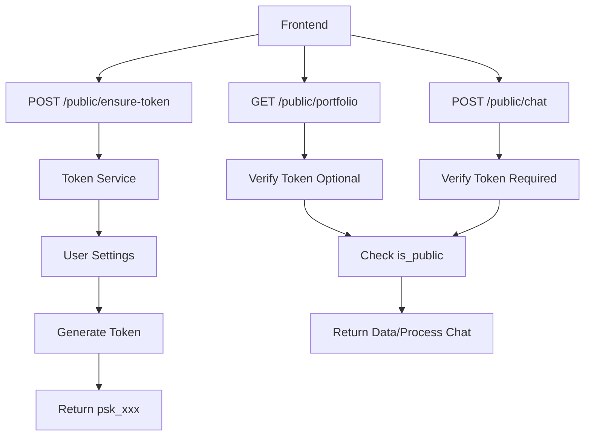

# Design Document

## Overview

This design outlines the minimal changes needed to migrate from Firebase-based authentication to a deterministic token-based system for public portfolio access and chat. The system uses HMAC-SHA256 tokens with per-user version control, allowing immediate token invalidation. The migration removes all legacy Firebase authentication code from public endpoints while maintaining existing rate limiting and usage tracking functionality.

## Architecture

### High-Level Changes



### Key Components

1. **Token Service** - New service for token generation and verification
2. **Updated Public Routes** - Modified endpoints with token support
3. **Updated User Settings Schema** - Added token fields
4. **Updated Rate Limiting** - Token-based rate limit keys
5. **Frontend Token Integration** - Components accept and use tokens

## Important: Per-User Version Storage

**Critical Design Point:** The `public_token_ver` field is stored **per-user** in the Firebase `user_settings` collection. This means:

1. **Every token operation requires a Firebase query** to fetch the user's current version
2. **Token generation flow:**
   - Fetch user_settings by username → Get user's `public_token_ver` → Generate token with that version
3. **Token verification flow:**
   - Fetch user_settings by username → Get user's `public_token_ver` → Verify token matches that version
4. **Token invalidation:**
   - User increments their own `public_token_ver` in Firebase → All their tokens immediately invalid
   - Other users' tokens are unaffected (they have their own version numbers)

This is NOT a global version - each user has their own independent version number.

## Components and Interfaces

### Backend Components

#### Token Service (`backend/app/services/public_token_service.py`)

**PublicTokenService Class**

Core service for token generation and verification:

```python
class PublicTokenService:
    """Service for generating and verifying deterministic public tokens."""

    def __init__(self, global_secret: str):
        """Initialize with global secret from environment."""
        if not global_secret:
            raise ValueError("GLOBAL_SECRET must be configured")
        self.global_secret = global_secret.encode('utf-8')

    def derive_public_token(self, username: str, token_version: int) -> str:
        """
        Generate deterministic token for username and version.

        Format: psk_ + base64url(HMAC_SHA256(secret, "username|vN"))[:32]
        """
        message = f"{username}|v{token_version}".encode('utf-8')
        hmac_hash = hmac.new(self.global_secret, message, hashlib.sha256).digest()
        token_bytes = base64.urlsafe_b64encode(hmac_hash)[:32]
        return f"psk_{token_bytes.decode('utf-8')}"

    def verify_public_token(self, username: str, token: str, token_version: int) -> bool:
        """
        Verify token matches username and version using constant-time comparison.
        """
        if not token.startswith("psk_"):
            return False

        expected_token = self.derive_public_token(username, token_version)
        return hmac.compare_digest(token, expected_token)
```

**Key Design Decisions:**

- Uses HMAC-SHA256 for cryptographic security
- Base64url encoding for URL-safe tokens
- Constant-time comparison prevents timing attacks
- Deterministic generation (same username + version = same token)
- No database lookups needed for verification

#### Updated User Settings Schema (`backend/app/schemas/user_settings.py`)

**Extended UserSettings Model**

```python
class UserSettings(BaseModel):
    user_id: str
    username: Optional[str] = None
    is_public: bool = False

    # New token fields
    public_token_enabled: bool = True  # Allow token generation
    public_token_ver: int = 1  # Version for invalidation

    # ... existing fields ...
```

**Token Version Management:**

- Default version is 1 for all new users
- Version is stored per-user in Firebase user_settings collection
- Every token operation requires fetching user settings to get current version
- Incrementing a user's version immediately invalidates only their tokens
- No grace period or migration needed
- Simple integer increment for invalidation
- Different users have independent version numbers

#### New Endpoint: POST /public/ensure-username

**Route Handler (`backend/app/routes/public_portfolio.py`)**

```python
@router.post("/ensure-username")
async def ensure_username(request: EnsureUsernameRequest):
    """
    Get or generate username for a user_id.

    Flow:
    1. Fetch user settings by user_id
    2. If username exists, return it
    3. If no username, get user email from Firebase Auth
    4. Generate username from email (part before @)
    5. Try username alone first
    6. If taken, append 6-char URL-safe random string
    7. Store username in user_settings
    8. Return { username: "..." }
    """
```

**Request/Response Models:**

```python
class EnsureUsernameRequest(BaseModel):
    user_id: str = Field(..., min_length=1)

class EnsureUsernameResponse(BaseModel):
    username: str
```

**Username Generation Logic:**

```python
def generate_username_from_email(email: str, user_settings_service) -> str:
    """
    Generate unique username from email.

    1. Extract part before @ from email
    2. Sanitize to alphanumeric + hyphens/underscores
    3. Try username alone
    4. If taken, append random 6-char string (base62: a-zA-Z0-9)
    5. Keep trying until unique (max 10 attempts)
    """
    import secrets
    import string

    # Extract and sanitize email prefix
    email_prefix = email.split('@')[0]
    base_username = re.sub(r'[^a-zA-Z0-9_-]', '', email_prefix).lower()

    # Try base username first
    if not user_settings_service.get_user_settings_by_username(base_username):
        return base_username

    # Try with random suffix
    chars = string.ascii_letters + string.digits
    for _ in range(10):
        suffix = ''.join(secrets.choice(chars) for _ in range(6))
        username = f"{base_username}_{suffix}"
        if not user_settings_service.get_user_settings_by_username(username):
            return username

    raise ValueError("Failed to generate unique username")
```

#### New Endpoint: POST /public/ensure-token

**Route Handler (`backend/app/routes/public_portfolio.py`)**

```python
@router.post("/ensure-token")
async def ensure_public_token(request: EnsureTokenRequest):
    """
    Generate public token for a username.

    Returns 404 if:
    - Username doesn't exist
    - Portfolio is private (is_public == false)
    - Token generation disabled (public_token_enabled == false)
    """
    # 1. Fetch user settings by username
    # 2. Check is_public == true
    # 3. Check public_token_enabled == true
    # 4. Generate token using username + public_token_ver
    # 5. Return { token: "psk_..." }
```

**Request/Response Models:**

```python
class EnsureTokenRequest(BaseModel):
    username: str = Field(..., min_length=1, max_length=50)

class EnsureTokenResponse(BaseModel):
    token: str  # Format: "psk_xxx..."
```

#### Updated Endpoint: GET /public/portfolio/{username}

**Changes to Existing Route:**

```python
@router.get("/portfolio/{username}")
async def get_public_portfolio(
    username: str,
    authorization: Optional[str] = Header(None)
):
    """
    Get public portfolio with optional token verification.

    Behavior:
    - If Authorization header present: verify token, return 401 if invalid
    - If no Authorization header: skip token verification
    - Always check is_public == true, return 404 if false
    - Return portfolio data if all checks pass
    """
    # 1. If authorization header present:
    #    - Extract Bearer token
    #    - Fetch user settings to get public_token_ver
    #    - Verify token matches username + version
    #    - Return 401 if invalid
    # 2. Fetch user settings
    # 3. Check is_public == true (404 if false)
    # 4. Fetch and return portfolio data
```

**Key Changes:**

- Add optional `authorization` header parameter
- Add token verification logic when header present
- Maintain backward compatibility (no header = no verification)
- Keep existing is_public check

#### New Endpoint: POST /public/chat/{username}

**Route Handler (`backend/app/routes/public_portfolio.py` or new `public_chat.py`)**

```python
@router.post("/chat/{username}")
async def chat_with_public_portfolio(
    username: str,
    request: Request,
    chat_request: ChatRequest,
    authorization: str = Header(...),  # Required
    ip_address: str = Depends(get_client_ip),
):
    """
    Chat with public portfolio using token authentication.

    Required: Authorization: Bearer <token>

    Flow:
    1. Verify token for username
    2. Check is_public == true
    3. Apply rate limiting (IP, username, token)
    4. Process chat using existing AIChatService
    5. Store conversation using ChatStorageService
    6. Increment portfolio owner usage
    7. Return streaming response
    """
```

**Key Design Decisions:**

- Moves chat from `/api/chat/{username}` to `/public/chat/{username}`
- Requires Authorization header (no optional)
- Reuses existing chat infrastructure (AIChatService, ChatStorageService)
- Updates rate limiting keys to use token instead of user_id
- Maintains all existing chat functionality (streaming, tool calls, etc.)

#### Updated Rate Limiting (`backend/app/dependencies/chat_rate_limiting.py`)

**Changes to Rate Limit Keys:**

```python
# OLD: Rate limit key based on user_id
rate_limit_key = f"chat_ip_{ip_address}_user_{user_id}"

# NEW: Rate limit key based on token
rate_limit_key = f"chat_ip_{ip_address}_username_{username}_token_{token_hash}"
```

**Token Hash for Keys:**

- Use first 8 characters of token for rate limit keys
- Ensures different tokens get different rate limit buckets
- When token version changes, new token = new rate limit window

**Updated Dependencies:**

```python
async def check_chat_rate_limit_with_token(
    username: str,
    token: str,
    request: Request
) -> str:
    """
    Check rate limit using IP + username + token.
    Returns IP address for downstream use.
    """
    ip_address = get_client_ip(request)
    token_hash = token[:8]  # Use token prefix for key
    rate_limit_key = f"chat_{ip_address}_{username}_{token_hash}"

    # Apply existing rate limiting logic
    # ...
```

#### Legacy Code Removal

**Files to Delete:**

- `backend/app/dependencies/portfolio_access.py` - No longer needed

**Code to Remove from `backend/app/routes/chat.py`:**

- Remove `check_portfolio_access` dependency import
- Remove `portfolio_owner_user_id` parameter
- Remove Firebase authentication checks

**Code to Remove from Rate Limiting:**

- Remove user_id-based rate limit keys
- Remove Firebase auth token verification

### Frontend Components

#### Updated Template Components Props

**Portfolio Component (`packages/template-components/src/components/Portfolio.tsx`)**

```typescript
interface PortfolioProps {
  apiBaseUrl: string;
  username: string;
  publicToken?: string; // Optional token for authenticated requests
  // ... existing props
}
```

**ChatPortfolio Component (`packages/template-components/src/components/ChatPortfolio.tsx`)**

```typescript
interface ChatPortfolioProps {
  apiBaseUrl: string;
  username: string;
  publicToken?: string; // Required for chat to work
  // ... existing props
}
```

#### Updated API Client (`packages/template-components/src/clients/public-api-client.ts`)

**Portfolio Fetch with Optional Token:**

```typescript
async function fetchPublicPortfolio(
  apiBaseUrl: string,
  username: string,
  publicToken?: string
): Promise<PortfolioData> {
  const headers: Record<string, string> = {
    "Content-Type": "application/json",
  };

  if (publicToken) {
    headers["Authorization"] = `Bearer ${publicToken}`;
  }

  const response = await fetch(`${apiBaseUrl}/public/portfolio/${username}`, {
    headers,
  });

  if (!response.ok) {
    throw new Error(`Failed to fetch portfolio: ${response.status}`);
  }

  return response.json();
}
```

**Chat with Required Token:**

```typescript
async function chatWithPortfolio(
  apiBaseUrl: string,
  username: string,
  publicToken: string, // Required
  message: string,
  conversationId?: string
): Promise<EventSource> {
  if (!publicToken) {
    throw new Error("Public token required for chat");
  }

  const eventSource = new EventSource(`${apiBaseUrl}/public/chat/${username}`, {
    headers: {
      Authorization: `Bearer ${publicToken}`,
      "Content-Type": "application/json",
    },
    method: "POST",
    body: JSON.stringify({ message, conversation_id: conversationId }),
  });

  return eventSource;
}
```

#### Preview Page Integration

**Token Fetching Flow:**

```typescript
// In preview page component (e.g., apps/template/src/app/page.tsx)

const [username, setUsername] = useState<string | undefined>();
const [publicToken, setPublicToken] = useState<string | undefined>();
const [error, setError] = useState<string | undefined>();
const [loading, setLoading] = useState(true);

useEffect(() => {
  async function fetchToken() {
    if (!username) return;

    try {
      const response = await fetch(`${apiBaseUrl}/public/ensure-token`, {
        method: "POST",
        headers: { "Content-Type": "application/json" },
        body: JSON.stringify({ username }),
      });

      if (response.status === 404) {
        setError("Portfolio not found");
        setLoading(false);
        return;
      }

      if (!response.ok) {
        throw new Error("Failed to fetch token");
      }

      const data = await response.json();
      setPublicToken(data.token);
      setLoading(false);
    } catch (err) {
      setError("Failed to load portfolio");
      setLoading(false);
    }
  }

  fetchToken();
}, [username, apiBaseUrl]);

// Render portfolio only when both username and token are available
if (loading) return <LoadingScreen />;
if (error) return <ErrorScreen message={error} />;
if (!username || !publicToken) return null;

return (
  <Portfolio
    apiBaseUrl={apiBaseUrl}
    username={username}
    publicToken={publicToken}
  />
);
```

**Key Points:**

- Wait for username to be resolved before fetching token
- Handle 404 as "Portfolio not found" (covers private, disabled, or missing)
- Only render portfolio components after token is fetched
- Pass token to all components that need it

## Data Models

### Backend Models

**Token and Username Request/Response (`backend/app/schemas/public_token.py`)**

```python
from pydantic import BaseModel, Field

class EnsureUsernameRequest(BaseModel):
    """Request to get or generate a username."""
    user_id: str = Field(..., min_length=1)

class EnsureUsernameResponse(BaseModel):
    """Response containing the username."""
    username: str

class EnsureTokenRequest(BaseModel):
    """Request to generate a public token."""
    username: str = Field(..., min_length=1, max_length=50)

class EnsureTokenResponse(BaseModel):
    """Response containing the public token."""
    token: str  # Format: "psk_xxx..."
```

**Updated User Settings (`backend/app/schemas/user_settings.py`)**

```python
class UserSettings(BaseModel):
    user_id: str
    username: Optional[str] = None
    is_public: bool = False

    # Token settings
    public_token_enabled: bool = True
    public_token_ver: int = 1

    # ... existing fields (chat_settings, etc.)
```

### Frontend Models

**Token and Username Types (`packages/template-components/src/types/index.ts`)**

```typescript
export interface EnsureUsernameRequest {
  user_id: string;
}

export interface EnsureUsernameResponse {
  username: string;
}

export interface EnsureTokenRequest {
  username: string;
}

export interface EnsureTokenResponse {
  token: string;
}

export interface PortfolioConfig {
  apiBaseUrl: string;
  username: string;
  publicToken?: string;
}
```

## Configuration

### Environment Variables

**Backend (`backend/.env`)**

```bash
# Required: Global secret for token generation
GLOBAL_SECRET=your-secret-key-here-min-32-chars

# Existing variables...
```

**Startup Validation:**

```python
# In backend/app/core/config.py
class Settings(BaseSettings):
    GLOBAL_SECRET: str

    @validator('GLOBAL_SECRET')
    def validate_global_secret(cls, v):
        if not v or len(v) < 32:
            raise ValueError('GLOBAL_SECRET must be at least 32 characters')
        return v
```

## Error Handling

### Backend Error Responses

**Token Generation Errors:**

```python
# Username not found
HTTPException(status_code=404, detail="Portfolio not found")

# Portfolio is private
HTTPException(status_code=404, detail="Portfolio not found")

# Token generation disabled
HTTPException(status_code=404, detail="Portfolio not found")
```

**Token Verification Errors:**

```python
# Invalid token format
HTTPException(status_code=401, detail="Invalid token")

# Token version mismatch
HTTPException(status_code=401, detail="Invalid token")

# Missing Authorization header (chat only)
HTTPException(status_code=401, detail="Authorization required")
```

**Rate Limiting Errors:**

```python
# Existing rate limit handling
HTTPException(
    status_code=429,
    detail="Rate limit exceeded",
    headers={"Retry-After": "3600"}
)
```

### Frontend Error Handling

**Token Fetch Errors:**

```typescript
// 404 - Portfolio not found/private/disabled
if (response.status === 404) {
  showError("Portfolio not found");
}

// Other errors
if (!response.ok) {
  showError("Failed to load portfolio");
}
```

**Chat Errors:**

```typescript
// Missing token
if (!publicToken) {
  showError("Chat unavailable - please refresh the page");
}

// 401 - Invalid token
if (response.status === 401) {
  showError("Session expired - please refresh the page");
}
```

## Security Considerations

### Token Security

**Cryptographic Strength:**

- HMAC-SHA256 provides strong cryptographic security
- 32-character base64url tokens = 192 bits of entropy
- Constant-time comparison prevents timing attacks

**Token Invalidation:**

- Immediate invalidation by incrementing version
- No grace period needed
- Simple integer increment operation

**Secret Management:**

- Global secret stored in environment variables
- Never exposed to frontend
- Minimum 32 characters required
- Should be rotated periodically (requires version bump for all users)

### Rate Limiting Security

**Token-Based Rate Limiting:**

- Rate limits keyed by (IP, username, token)
- Different tokens get separate rate limit buckets
- Prevents abuse through token rotation
- Maintains existing 50 req/hour per IP limit

**IP Address Tracking:**

- Continue tracking IP addresses for security
- Helps identify abuse patterns
- Used in rate limiting calculations

## Performance Considerations

### Token Generation Performance

**Fast Token Generation:**

- HMAC-SHA256 is computationally efficient
- No database lookups during generation
- Single Firebase query to get user settings
- Target: < 50ms for token generation

**Token Verification Performance:**

- Constant-time comparison is fast
- Single Firebase query to get token version
- No additional database operations
- Target: < 30ms for verification

### Caching Opportunities

**User Settings Caching:**

```python
# Optional: Cache user settings for token verification
# Cache key: f"user_settings_{username}"
# TTL: 60 seconds
# Reduces Firebase queries for repeated requests
```

**Note:** Caching is optional for initial implementation. Can be added later if needed.

## Migration Strategy

### Phase 1: Add Token System (No Breaking Changes)

1. Add token service and schemas
2. Add `/public/ensure-token` endpoint
3. Update `/public/portfolio/{username}` to accept optional token
4. Keep existing `/api/chat/{username}` working
5. Deploy backend changes

### Phase 2: Add New Chat Endpoint

1. Add `/public/chat/{username}` with required token
2. Keep old `/api/chat/{username}` for backward compatibility
3. Deploy backend changes

### Phase 3: Update Frontend

1. Update template components to accept token props
2. Update preview page to fetch tokens
3. Update API clients to use new endpoints
4. Deploy frontend changes

### Phase 4: Remove Legacy Code

1. Delete `/api/chat/{username}` endpoint
2. Delete `portfolio_access.py` dependency
3. Remove Firebase auth checks from public routes
4. Deploy final cleanup

**Note:** Since the app has no users, we can skip phases 1-3 and do everything at once. The phased approach is documented for reference only.

## Testing Strategy

### Backend Testing

**Token Service Tests:**

```python
# Test token generation
def test_derive_public_token():
    # Same username + version = same token
    # Different version = different token
    # Token format validation

# Test token verification
def test_verify_public_token():
    # Valid token returns True
    # Invalid token returns False
    # Wrong version returns False
    # Constant-time comparison
```

**Endpoint Tests:**

```python
# Test /public/ensure-token
def test_ensure_token_success():
    # Public portfolio returns token

def test_ensure_token_private():
    # Private portfolio returns 404

def test_ensure_token_disabled():
    # Token disabled returns 404

# Test /public/portfolio/{username}
def test_portfolio_with_valid_token():
    # Valid token returns portfolio

def test_portfolio_with_invalid_token():
    # Invalid token returns 401

def test_portfolio_without_token():
    # No token returns portfolio (backward compatible)

# Test /public/chat/{username}
def test_chat_with_valid_token():
    # Valid token processes chat

def test_chat_without_token():
    # No token returns 401

def test_chat_with_invalid_token():
    # Invalid token returns 401
```

**Rate Limiting Tests:**

```python
def test_rate_limiting_with_tokens():
    # Different tokens get separate limits
    # Same token shares limit across requests
    # Token change resets limits
```

### Frontend Testing

**Manual Testing Sufficient:**

- Token fetching flow
- Portfolio rendering with token
- Chat functionality with token
- Error states (404, 401, etc.)
- Token refresh on error

**No automated frontend tests required** for this migration.

## Implementation Notes

### Backward Compatibility

**Portfolio Endpoint:**

- Maintains backward compatibility by making token optional
- Existing clients without tokens continue to work
- New clients can add token for future features

**Chat Endpoint:**

- New endpoint at `/public/chat/{username}` requires token
- Old endpoint at `/api/chat/{username}` will be removed
- No backward compatibility needed (no users yet)

### Token Rotation Strategy

**User-Level Rotation:**

- Portfolio owner increments `public_token_ver` in settings
- All previous tokens immediately invalid
- New token generated on next `/public/ensure-token` call

**Global Secret Rotation:**

- Requires incrementing `public_token_ver` for all users
- Can be done via migration script if needed
- Should be rare (only for security incidents)

### Monitoring and Logging

**Token Operations:**

```python
# Log token generation
logger.info(f"Generated token for username={username} version={version}")

# Log token verification failures
logger.warning(f"Invalid token for username={username}")

# Log rate limit hits
logger.warning(f"Rate limit exceeded for token={token[:8]}...")
```

**Metrics to Track:**

- Token generation requests per minute
- Token verification failures per minute
- Rate limit hits per hour
- Chat requests per token per hour
