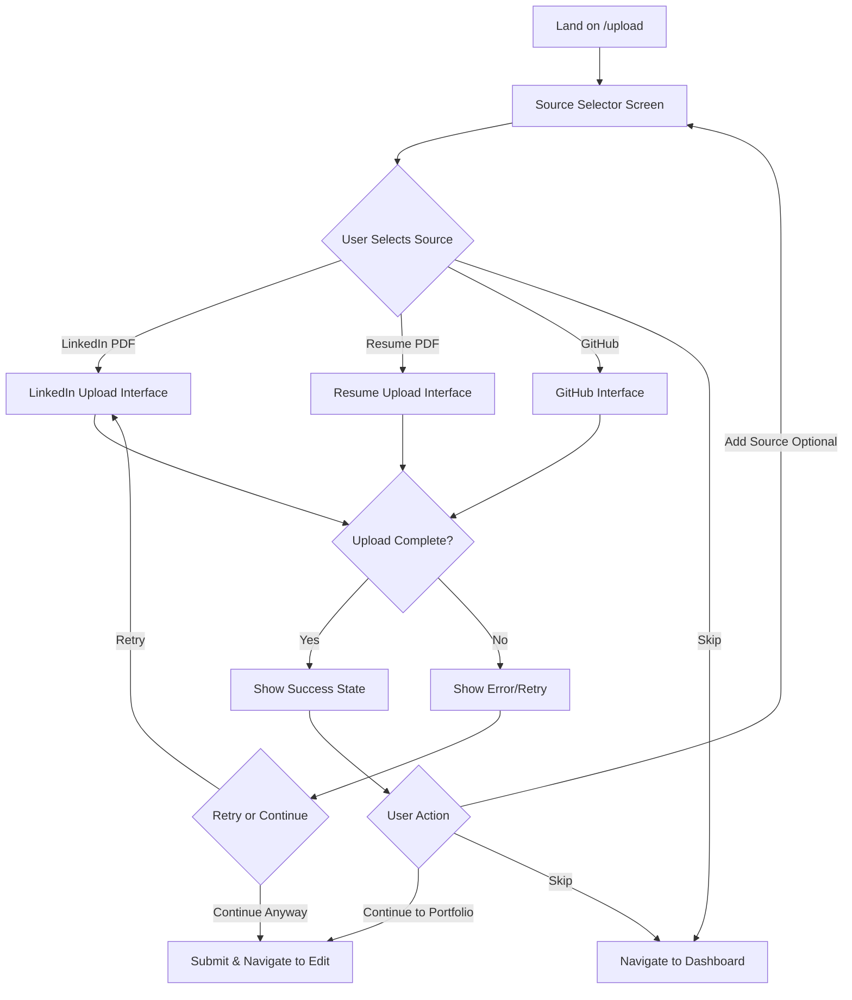

# Design Document

## Overview

The upload UI revamp transforms the existing 3-step wizard into a streamlined, source-first experience optimized for speed. Users select a single data source, complete that upload, and quickly proceed to their portfolio. The design emphasizes visual elegance, minimal friction, and clear user guidance while maintaining all existing backend functionality. An optional "Add Source" feature allows power users to combine multiple sources without cluttering the primary flow.

## Architecture

### High-Level User Flow



### Component Architecture

```
UploadPage
├── SourceSelector (initial state)
│   ├── SourceCard (LinkedIn)
│   ├── SourceCard (Resume)
│   ├── SourceCard (GitHub)
│   └── SkipButton
│
└── SourceUploadView (after selection)
    ├── BackButton
    ├── SourceInterface (dynamic)
    │   ├── LinkedInUploadInterface
    │   ├── ResumeUploadInterface
    │   └── GitHubInterface
    │
    └── ActionPanel (after upload)
        ├── SourcesSummary (compact)
        ├── ContinueButton (prominent)
        └── AddSourceLink (subtle, corner)
```

## Components and Interfaces

### 1. SourceSelector Component

The initial screen users see when landing on `/upload`.

**Visual Design:**

- Clean, centered layout with ample whitespace
- Page title: "Create Your Portfolio in Seconds"
- Subtitle: "Choose a source to get started - you can always add more later"
- Three large, card-based options arranged horizontally (stack on mobile)
- Each card has: icon, title, motivational description, and subtle badge/note
- "I'll fill it manually" link at the bottom (navigates directly to edit page)

**Component Structure:**

```typescript
interface SourceSelectorProps {
  onSelectSource: (source: "linkedin" | "resume" | "github") => void;
  onManualFill: () => void; // Navigate directly to edit page
  usedSources?: Set<string>; // for showing which sources already added
}

const SourceSelector: React.FC<SourceSelectorProps> = ({
  onSelectSource,
  onManualFill,
  usedSources = new Set(),
}) => {
  // Render three source cards with hover effects
  // Show checkmark badge if source already used
  // Handle click to select source
  // "I'll fill it manually" link navigates to edit page
};
```

**Source Card Details:**

**LinkedIn Card:**

- Icon: LinkedIn logo
- Title: "LinkedIn Profile"
- Description: "Instantly import your work experience and education"
- Badge: "No authentication required"
- Visual: Blue accent color

**Resume Card:**

- Icon: Document/file icon
- Title: "Resume PDF"
- Description: "Transform your resume into a beautiful portfolio"
- Badge: "Quick upload"
- Visual: Green accent color

**GitHub Card:**

- Icon: GitHub logo
- Title: "GitHub Repositories"
- Description: "Showcase your best projects and code"
- Badge: "Username only"
- Visual: Purple accent color

### 2. SourceUploadView Component

Displays the upload interface for the selected source.

**Component Structure:**

```typescript
interface SourceUploadViewProps {
  selectedSource: "linkedin" | "resume" | "github";
  onBack: () => void;
  onComplete: (data: UploadData) => void;
  onError: (error: Error) => void;
}

const SourceUploadView: React.FC<SourceUploadViewProps> = ({
  selectedSource,
  onBack,
  onComplete,
  onError,
}) => {
  // Render appropriate interface based on selectedSource
  // Show back button to return to selector
  // Handle upload completion
};
```

**Interface Mapping:**

- `linkedin` → Reuse existing `PDFUploadStep` with LinkedIn configuration
- `resume` → Reuse existing `PDFUploadStep` with Resume configuration
- `github` → Reuse existing `GithubRepoStep`

**Key Changes to Existing Components:**

- Remove step indicators and progress bars
- Remove "Next" and "Skip" buttons from step containers
- Add completion callback instead of navigation
- Simplify layout to focus on single task

### 3. ActionPanel Component

Shown after successful upload, provides options to continue or add more sources.

**Visual Design:**

- Appears below the upload interface after success
- Success message with checkmark icon
- Compact summary of uploaded sources (if multiple)
- Large, prominent "Continue to Edit" button
- Small, subtle "Add another source" link in top-right corner

**Component Structure:**

```typescript
interface ActionPanelProps {
  uploadedSources: UploadedSource[];
  onContinue: () => void;
  onAddSource: () => void;
  onRemoveSource: (sourceType: string) => void;
  isSubmitting: boolean;
}

interface UploadedSource {
  type: "linkedin" | "resume" | "github";
  status: "success" | "error";
  summary: string; // e.g., "Resume.pdf (2 pages)" or "5 repositories"
}

const ActionPanel: React.FC<ActionPanelProps> = ({
  uploadedSources,
  onContinue,
  onAddSource,
  onRemoveSource,
  isSubmitting,
}) => {
  // Show success state with message like "Great! Your data is ready"
  // Display compact source summary
  // Prominent "Continue to Edit" button
  // Subtle "Add another source" link in corner
};
```

### 4. SourcesSummary Component

Compact display of all uploaded sources.

**Visual Design:**

- Horizontal list of small chips/badges
- Each chip shows: source icon, source type, and remove button
- Appears only when multiple sources are uploaded
- Minimal visual weight to not distract from main action

**Component Structure:**

```typescript
interface SourcesSummaryProps {
  sources: UploadedSource[];
  onRemove: (sourceType: string) => void;
}

const SourcesSummary: React.FC<SourcesSummaryProps> = ({
  sources,
  onRemove,
}) => {
  // Render compact chips for each source
  // Show remove button on hover
};
```

### 5. Enhanced Upload Interfaces

**LinkedInUploadInterface:**

- Reuse existing `PDFUploadStep` component
- Add prominent note: "No LinkedIn authentication required - just upload your PDF"
- Maintain existing help section with export instructions
- Remove step navigation, add completion callback

**ResumeUploadInterface:**

- Reuse existing `PDFUploadStep` component
- Simplified messaging focused on quick upload
- Remove step navigation, add completion callback

**GitHubInterface:**

- Reuse existing `GithubRepoStep` component
- Add note: "Simply enter your GitHub username - no authentication needed"
- Add clarification: "Only public repositories will be accessed"
- Remove step navigation, add completion callback

## Data Flow

### State Management

```typescript
interface UploadState {
  // Current view
  currentView: "selector" | "uploading" | "complete";

  // Selected source for current upload
  selectedSource: "linkedin" | "resume" | "github" | null;

  // Uploaded data
  uploadedSources: Map<string, UploadData>;

  // UI state
  isSubmitting: boolean;
  error: Error | null;
}

interface UploadData {
  type: "linkedin" | "resume" | "github";
  data: PDFUploadResponse | GitHubReposData;
  uploadedAt: Date;
}
```

### Upload Flow

1. **Initial State**: Show `SourceSelector`
2. **User Chooses Manual Fill**: Navigate directly to edit page (no backend submission)
3. **Source Selected**: Transition to `SourceUploadView` with selected source
4. **Upload in Progress**: Show loading/progress indicators within interface
5. **Upload Complete**: Show `ActionPanel` with success state
6. **User Continues**: Submit all data and navigate to edit page
7. **User Adds Source**: Return to `SourceSelector` with used sources marked

### Data Submission

When user clicks "Continue to Edit":

```typescript
async function handleContinue() {
  setIsSubmitting(true);

  try {
    // Collect all uploaded data
    const linkedinData = uploadedSources.get("linkedin");
    const resumeData = uploadedSources.get("resume");
    const githubData = uploadedSources.get("github");

    // Submit to existing backend endpoint
    const result = await submitAllData({
      linkedin: linkedinData,
      resume: resumeData,
      github: githubData,
    });

    // Show success and navigate
    showSuccessToast("Portfolio data processed successfully!");
    router.push("/edit");
  } catch (error) {
    // Show error but allow proceeding
    showErrorToast("Processing failed, but you can still edit manually");
    router.push("/edit");
  } finally {
    setIsSubmitting(false);
  }
}
```

## Visual Design System

### Color Palette

- **LinkedIn**: Blue (#0A66C2)
- **Resume**: Green (#10B981)
- **GitHub**: Purple (#6366F1)
- **Success**: Green (#22C55E)
- **Error**: Red (#EF4444)
- **Neutral**: Gray scale from design system

### Typography

- **Page Title**: 2xl font, bold, centered
- **Subtitle**: base font, muted color, centered
- **Card Title**: lg font, semibold
- **Card Description**: sm font, muted color
- **Badges**: xs font, uppercase, subtle background

### Spacing

- **Container**: max-w-4xl, centered with padding
- **Card Grid**: gap-6 on desktop, gap-4 on mobile
- **Section Spacing**: space-y-8 for major sections
- **Component Spacing**: space-y-4 for related elements

### Animations

- **Card Hover**: Subtle scale (1.02) and shadow increase
- **Transitions**: 200ms ease-in-out for all interactions
- **Success State**: Fade-in with slide-up animation
- **Loading**: Smooth spinner or skeleton states

## Responsive Design

### Desktop (≥1024px)

- Three-column grid for source cards
- Horizontal layout for action panel
- Ample whitespace and large touch targets

### Tablet (768px - 1023px)

- Two-column grid for source cards (GitHub wraps)
- Maintain horizontal action panel
- Slightly reduced spacing

### Mobile (<768px)

- Single-column stack for source cards
- Vertical action panel layout
- Full-width buttons
- Reduced padding and spacing
- Sticky action panel at bottom

## Error Handling

### Upload Errors

**File Validation Errors:**

- Show inline error message below upload area
- Provide clear guidance on what went wrong
- Allow retry without losing other uploaded sources

**Network Errors:**

- Show toast notification with error message
- Provide "Retry" button
- Allow user to continue with other sources or skip

**Backend Errors:**

- Show friendly error message
- Offer to proceed to edit page anyway
- Log error for debugging

### Error States

```typescript
interface ErrorState {
  type: "validation" | "network" | "backend";
  message: string;
  retryable: boolean;
  source?: "linkedin" | "resume" | "github";
}

function handleError(error: ErrorState) {
  if (error.retryable) {
    // Show retry button
    showErrorWithRetry(error.message);
  } else {
    // Show error and allow proceeding
    showErrorWithContinue(error.message);
  }
}
```

## Accessibility

### Keyboard Navigation

- All interactive elements keyboard accessible
- Logical tab order through source cards
- Enter key to select source
- Escape key to go back

### Screen Readers

- Proper ARIA labels for all interactive elements
- Status announcements for upload progress
- Clear labeling of optional vs required actions

### Visual Accessibility

- High contrast ratios for all text
- Clear focus indicators
- Icons paired with text labels
- Color not sole indicator of state

## Performance Considerations

### Code Splitting

- Lazy load upload interfaces only when selected
- Separate chunks for PDF and GitHub components
- Preload likely next component on hover

### Optimizations

- Debounce GitHub username search
- Optimize image assets (icons, illustrations)
- Minimize re-renders with proper memoization
- Use React.memo for static components

## Migration from Existing Implementation

### Reusable Components

- `PDFUploadStep` → Adapt for standalone use
- `GithubRepoStep` → Adapt for standalone use
- `useUpload` hook → Reuse with minimal changes
- API client functions → No changes needed

### New Components

- `SourceSelector` → New component
- `SourceUploadView` → New orchestrator
- `ActionPanel` → New component
- `SourcesSummary` → New component

### Removed Components

- `UploadWizard` → Replaced by new flow
- `ProgressIndicator` → No longer needed
- `StepContainer` → Simplified version in new components

### Backend Compatibility

- All existing API endpoints remain unchanged
- Same data submission format
- Same authentication and rate limiting
- Same error responses

## Testing Strategy

### Component Tests

- SourceSelector renders all three options
- Source selection triggers correct interface
- Back button returns to selector
- Add source shows selector with used sources marked
- Continue button submits data correctly

### Integration Tests

- Complete flow: select → upload → continue
- Multiple sources flow: select → upload → add → upload → continue
- Error handling: upload fails → retry → success
- Skip flow: skip from selector → navigate to dashboard

### Visual Regression Tests

- Source selector layout on all screen sizes
- Upload interfaces maintain existing appearance
- Action panel layout and positioning
- Mobile responsive behavior

### Accessibility Tests

- Keyboard navigation through entire flow
- Screen reader announcements
- Focus management
- ARIA labels and roles

## Implementation Notes

### Phase 1: Core Components

1. Create `SourceSelector` component
2. Create `SourceUploadView` orchestrator
3. Create `ActionPanel` component
4. Adapt existing upload interfaces

### Phase 2: State Management

1. Implement upload state management
2. Handle source selection and switching
3. Manage multiple source uploads
4. Implement data submission

### Phase 3: Polish

1. Add animations and transitions
2. Implement responsive design
3. Add accessibility features
4. Optimize performance

### Phase 4: Testing & Refinement

1. Write component tests
2. Conduct user testing
3. Fix bugs and refine UX
4. Performance optimization

## Success Metrics

### User Experience

- Time to complete single source upload (target: <2 minutes)
- Percentage of users completing upload (target: >80%)
- Percentage using multiple sources (expected: <30%)
- User satisfaction with clarity and simplicity

### Technical

- Page load time (target: <1s)
- Time to interactive (target: <2s)
- Error rate (target: <5%)
- Mobile usability score (target: >90)
